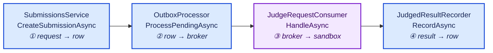

# Debugging guide

How to attach a debugger to every part of this system, in **VS Code** and in **Visual Studio**.

The interesting behaviour here is asynchronous and spread across two processes, so "put a breakpoint
on it" is not always enough. The [scenarios](#scenarios) section covers the awkward ones: a
submission that crosses a broker, a background service that runs on a timer, and code executing
inside a container the Judge destroys immediately afterwards.

---

## Before anything

Debugging fails in boring ways when the one-time setup is missing. Check these first.

### 1 · Secrets

Neither service starts without them, and the failure is an options-validation error at startup, not a
null later on.

`DsaPractice.Api`, the migrations project and `DsaPractice.Judge` share one `UserSecretsId`, so each
value is set **once** and all three see it.

```bash
# Postgres. Used by the Api and the migrator; the Judge cannot reach it (no DataAccess reference).
dotnet user-secrets set "ConnectionStrings:DsaPractice" \
  "Host=localhost;Port=5432;Database=dsapractice;Username=dsapractice;Password=<your .env password>" \
  --project source/DsaPractice.Api

# The broker URI carries credentials, so it is a secret too. Both the Api and the Judge need it.
dotnet user-secrets set "RabbitMq:Uri" \
  "amqp://dsapractice:<your .env password>@localhost:5672" \
  --project source/DsaPractice.Api
```

Check what is set, without guessing — any of the three projects prints the same store:

```bash
dotnet user-secrets list --project source/DsaPractice.Api
```

> **If `RabbitMq:Uri` is missing, the Judge does not start.** It fails at startup with
> `OptionsValidationException: RabbitMq:Uri must be an absolute amqp:// URI.` — options are validated
> with `ValidateOnStart()`, so a missing setting is a named error at launch rather than a null later
> on. That is the intended behaviour; the fix is the command above, not a code change.

### 2 · Infrastructure

```bash
cp .env.example .env        # one-time, gitignored
docker compose up -d        # postgres + rabbitmq + the one-shot migrator
docker compose ps           # postgres and rabbitmq should both be "healthy"
```

**Bring up infrastructure only.** Do *not* use `--profile full-stack` when you intend to debug —
that runs the Api and Judge in containers, and then your debugger's copy fights the container's for
the same queue. Symptom: breakpoints never hit, because the containerised Judge consumed the message
first.

### 3 · The Judge's fake executor

`Judge:UseFakeExecutor` decides whether submitted code is really run. The repo's
`source/DsaPractice.Judge/appsettings.json` sets it to **`false`**, so a normal local run executes
code for real — which is what you want when debugging the sandbox.

The *class* default is `true`, so if that setting is ever removed or overridden, nothing executes and
every submission comes back `Accepted` in milliseconds. The Judge logs a warning at startup when the
fake executor is active:

```
Judge is running with the FAKE executor: submissions are marked Accepted without being run.
```

If you see that line, or verdicts arrive impossibly fast, that is why. Force it either way for one
run:

```bash
Judge__UseFakeExecutor=false dotnet run --project source/DsaPractice.Judge   # real sandbox
Judge__UseFakeExecutor=true  dotnet run --project source/DsaPractice.Judge   # skip execution
```

---

## VS Code

### Extensions

| Extension | Needed for |
|---|---|
| **C# Dev Kit** (includes the C# extension) | Breakpoints, the debugger, Test Explorer |
| **Docker** | The Containers view, attaching to and inspecting running containers |
| **JavaScript Debugger** (built in) | Frontend breakpoints in the editor |

### What is already configured

`.vscode/launch.json` has four configurations and one compound:

| Pick | Does |
|---|---|
| **Api + Judge** | Launches both, debugger attached to each. `stopAll` — stopping one stops the other |
| **DsaPractice.Api** | Api alone on `http://localhost:51942`, opens `/scalar` once it is listening |
| **DsaPractice.Judge** | Judge alone |
| **DsaPractice.Migrator** | Migrations then content seeding. `cwd` is the repo root, because `Content:Path` resolves relative to the working directory |
| **Attach to a .NET process** | Attaches to something already running — see [attaching](#attaching-to-something-already-running) |

Each launch config has a `preLaunchTask` in `.vscode/tasks.json` that builds just that project, so
F5 never rebuilds the whole solution.

### Running one

1. `Ctrl+Shift+D` for the Run and Debug panel.
2. Pick a configuration from the dropdown.
3. `F5`.

For the full submission flow, pick **Api + Judge**. Before the compound existed you had to start each
separately and remember which you had running; you no longer do.

### Keys worth knowing

| Key | Does |
|---|---|
| `F5` | Start, or continue |
| `F9` | Toggle a breakpoint |
| `F10` / `F11` | Step over / step into |
| `Shift+F11` | Step out |
| `Ctrl+Shift+F5` | Restart |
| `Shift+F5` | Stop |
| `Ctrl+K Ctrl+I` | Value of whatever is under the cursor |

### Breakpoints that are not just breakpoints

Right-click in the gutter → **Add Conditional Breakpoint**:

| Kind | Use it for |
|---|---|
| **Expression** | `submission.Language == "csharp"` — stop only for the case you care about |
| **Hit count** | `>5` — stop on the sixth test case rather than the first |
| **Logpoint** | `Ordinal {testCase.Ordinal} → {outcome.Status}` — prints to the Debug Console and **does not stop**. The right tool for a loop |

Logpoints are the single most useful feature here. `DockerSandboxExecutor` runs a container per test
case; stopping on each is slow and changes the timing you are trying to observe. A logpoint does not.

### Catching an exception the handler swallows

`GlobalExceptionHandler` turns exceptions into `ProblemDetails`, so by the time you see a 500 the
stack is gone. Open the **Breakpoints** panel and tick:

- **All Exceptions** — stops at every throw, noisy but complete
- **User-Unhandled Exceptions** — stops only at what your code did not handle

Turn **All Exceptions** on, reproduce, read the real stack, turn it off again.

### Debugging tests

C# Dev Kit's Test Explorer shows every project. Right-click a test → **Debug Test**.

> **This repo runs tests on Microsoft.Testing.Platform**, configured in `global.json`. From the CLI
> that means `dotnet test --solution source/DsaPractice.slnx`, or `--project <path>` for one project —
> a bare `dotnet test <path>` is rejected with *"Specifying a project for 'dotnet test' should be via
> '--project'."* Test Explorer handles this itself; the note is for when you drop to a terminal.

Integration tests need Docker running — they start real Postgres and RabbitMQ through Testcontainers.
The first run pulls images and is slow; later runs are not.

### Attaching to something already running

Use the **Attach to a .NET process** configuration and pick from the list. Useful when:

- You started something with `dotnet run` and now want to inspect it without restarting.
- You want to catch startup code — set the breakpoint, then attach before it gets there. For anything
  truly at startup, launch instead.

### Debugging the frontend

```bash
cd frontend && npm run dev     # :5173, proxies /api to :8080
```

Then either:

- **In the browser.** Vite ships source maps, so Chrome or Edge DevTools shows your real `.tsx`.
  React DevTools gives you the component tree and TanStack Query's cache.
- **In VS Code.** Add a `chrome`-type launch config pointing at `http://localhost:5173` and set
  breakpoints in the editor.

For the Playwright suite:

```bash
cd frontend
npx playwright test --ui        # time-travel through each step
npx playwright test --debug     # Inspector, step through, pick selectors
npx playwright show-trace test-results/<...>/trace.zip   # after a CI failure
```

> **Playwright on this machine needs system libraries** that are installed with
> `sudo npx playwright install-deps`. Until that is run, the suite can be run through the
> `mcr.microsoft.com/playwright` image instead.

---

## Visual Studio

### Opening the solution

The solution is `source/DsaPractice.slnx` — the **XML** solution format, not the classic `.sln`.
Support arrived in Visual Studio 2022 17.13 behind **Tools → Options → Environment → Preview
Features → "Enable .slnx"**, and is on by default in later versions. Check **Help → About Microsoft
Visual Studio** for your version; if it will not open, either turn that preview feature on or work
from the CLI and open the individual `.csproj` files.

### Debugging both services at once

This is the Visual Studio equivalent of the **Api + Judge** compound, and it is the one setting most
people miss.

1. Right-click the **solution** → **Configure Startup Projects…**
2. Select **Multiple startup projects**.
3. Set both to **Start**:

   | Project | Action |
   |---|---|
   | `DsaPractice.Api` | Start |
   | `DsaPractice.Judge` | Start |
   | everything else | None |

4. `F5`. Both launch under the debugger; breakpoints in either are hit.

For the Api alone, right-click it → **Set as Startup Project**.

### Keys

| Key | Does |
|---|---|
| `F5` | Start, or continue |
| `Ctrl+F5` | Start **without** the debugger |
| `F9` | Toggle a breakpoint |
| `F10` / `F11` | Step over / step into |
| `Shift+F11` | Step out |
| `Ctrl+Shift+F10` | Set next statement — re-run a block without restarting |
| `Ctrl+Alt+Q` | QuickWatch |

### Breakpoint features Visual Studio has and VS Code does not

Right-click a breakpoint → **Conditions…**:

| Feature | Use it for |
|---|---|
| **Conditional expression** | Same as VS Code |
| **Hit count** | Same as VS Code |
| **Filter** | Restrict to a thread or process — useful when the Api's relay and consumer are both running |
| **Tracepoint** ("When Hit…") | Visual Studio's logpoint. Prints and continues |
| **Dependent breakpoint** | *Only stop here if that other breakpoint was hit first.* Ideal for this codebase: break in `JudgedResultRecorder` **only after** `JudgeRequestConsumer` handled the same submission |

### Exception Settings

**Debug → Windows → Exception Settings** (`Ctrl+Alt+E`). Tick **Common Language Runtime Exceptions**
to break at the throw rather than after `GlobalExceptionHandler` has converted it.

Narrow it: tick just `DsaPractice.Api.Exceptions.NotFoundException` to stop on that alone. Adding a
condition to exclude an exception type you expect is right there too — worth doing for
`OperationCanceledException`, which is control flow in the consumers rather than an error.

### Async debugging

Nearly everything here is `async`, and a plain call stack is not much help across an `await`.

| Window | Shows |
|---|---|
| **Debug → Windows → Tasks** | Every `Task` and its state. Finds a hung `await` |
| **Debug → Windows → Parallel Stacks** | All threads and async chains as one graph. Set it to **Tasks** mode |
| **Diagnostic Tools** | Memory and CPU while you step — enough to spot an allocation problem without a profiler |

### Containers window

**View → Other Windows → Containers** lists everything compose is running. Per container: logs,
environment, mounted volumes, a shell, and the files inside.

You will not catch a *sandbox* container here — they exist for well under a second and are removed in
a `finally`. See [debugging the sandbox](#4--the-sandbox) for what to do instead.

### Hot Reload

Works for method bodies while stopped at a breakpoint. It does **not** apply to changes in
`Program.cs` composition, a new field, or a signature change — those need a restart. If edits seem to
have no effect, that is why.

---

## Scenarios

### 1 · A submission, end to end

The flow crosses two processes and a broker, so there are four places worth a breakpoint.



Start **Api + Judge** (VS Code) or both startup projects (Visual Studio), then submit from
`http://localhost:5173` or from Scalar at `/scalar`.

**Beware breakpoint ①.** Sitting on it holds the transaction open, which blocks the relay's
`FOR UPDATE SKIP LOCKED` claim. That is correct behaviour, not a bug — but if you then wonder why
nothing publishes, that is why.

### 2 · The outbox relay

It is a `PeriodicTimer` loop on a one-second interval, so a breakpoint in `ProcessPendingAsync` fires
constantly, mostly with nothing to do. Make it conditional on `pending.Count > 0`, or put a logpoint
on `published`.

To watch a retry without stopping the broker for real:

```bash
docker compose stop rabbitmq
# submit -> still 201; watch AttemptCount climb and NextAttemptAtUtc back off
docker compose start rabbitmq
# the relay publishes it by itself within a poll or two
```

And to see the row directly:

```sql
SELECT "MessageId", "AttemptCount", "NextAttemptAtUtc", "ProcessedAtUtc", "LastError"
FROM "OutboxMessages" ORDER BY "OccurredAtUtc" DESC LIMIT 10;
```

```bash
docker compose exec postgres psql -U dsapractice -d dsapractice
```

### 3 · A consumer

Both consumers deliver on the RabbitMQ client's own threads, not on a request thread. Two
consequences:

- The call stack above your breakpoint is client library internals, not your code. Normal.
- **Sitting on a breakpoint stops you acking.** Stay too long and the broker may consider the
  connection unresponsive and redeliver. If a message seems to arrive twice while debugging,
  suspect that before suspecting a bug.

The management UI at `http://localhost:15672` (credentials from `.env`) shows queue depth,
unacked counts, and lets you inspect a message without consuming it.

**Check the dead-letter queue** — `submission.dead-letter`. Anything in it was rejected outright: a
payload that would not deserialise, or a Judge-side failure. It is meant to be empty.

### 4 · The sandbox

`DockerSandboxExecutor` creates a container, runs it, and removes it in a `finally`. The container is
gone before you can look at it, which makes the usual approach useless.

What works instead:

| Want | Do |
|---|---|
| To see the exact command | Breakpoint on `BuildCommand`'s return; the source is a base64 env var |
| To see the container config | Breakpoint after `CreateContainerAsync`, inspect the parameters |
| To keep a container alive | Temporarily comment out `RemoveContainerAsync` in the `finally`, then `docker exec` into it. **Revert this** — leaked containers accumulate |
| To reproduce a compile failure | Use `tools/check-starters.sh`; it runs the Judge's own compile command from its `appsettings.json` |
| To check the isolation | Run `DsaPractice.Judge.IntegrationTests` — `SandboxEscapeTests` asserts the controls hold |

Remember `Judge:UseFakeExecutor` must be `false` — it is in `appsettings.json`, but an environment
variable or a changed setting can override it, and then none of this runs at all.

### 5 · Content loading and seeding

Use the **DsaPractice.Migrator** launch configuration, which sets `cwd` to the repo root so
`content/` resolves. Breakpoints worth having:

- `ContentLoader.LoadStarters` — a starter not being picked up
- `QuestionSeeder.Apply` — a question reported as updated when nothing changed
- `QuestionSeeder.ReconcileTestCases` — a test case appearing or vanishing unexpectedly

`ContentLoader` collects problems rather than throwing at the first one, so to see everything wrong
at once, break on the `ContentException` construction and inspect the list.

### 6 · A failing integration test

They run against real Postgres and RabbitMQ in Testcontainers. Debug the test directly; the fixture
brings its own containers up and tears them down.

While stopped at a breakpoint, `docker ps` shows the test's containers with their mapped ports — you
can `psql` into the test database and look at the rows the test just wrote. They vanish when the test
ends.

If containers are left behind after a crashed run, the `testcontainers/ryuk` reaper normally clears
them; `docker ps -a --filter label=org.testcontainers=true` shows any that survived.

---

## When it will not work

| Symptom | Cause | Fix |
|---|---|---|
| Breakpoints never hit in the Judge | A containerised Judge consumed the message | `docker compose --profile full-stack down`, then bring up infrastructure only |
| Every submission is `Accepted` instantly | `Judge:UseFakeExecutor` is true — check the startup warning | Set `Judge__UseFakeExecutor=false` |
| Startup fails on options validation | A user-secret is missing | `dotnet user-secrets list --project …` |
| "Address already in use" after stopping | `dotnet run` spawns a child; killing the wrapper leaves it bound | `ss -ltnp \| grep <port>`, kill the real PID |
| Breakpoints are hollow / "not loaded" | Debugging a Release build, or a stale binary | Build Debug; check the `program` path in `launch.json` |
| Frontend calls 404 | Api not on `:8080`, which the Vite proxy targets | The debug config uses `:51942` — either run the Api on 8080 or point the proxy at 51942 |
| A submission stays `Pending` | Relay or Judge not running, or the broker is down | Check `OutboxMessages`, then `docker compose ps` |
| The same message arrives twice | Usually you sat on a breakpoint past the ack | Expected — the system is at-least-once by design |
| `dotnet test <path>` is rejected | MTP mode, from `global.json` | Use `--project <path>` or `--solution` |
| `docker compose down` fails, network in use | Profiled services still running | Always pass `--profile full-stack` to `down` |

> **The frontend port mismatch is worth reading twice.** `vite.config.ts` proxies `/api` to
> `http://localhost:8080`, but the VS Code launch config runs the Api on `51942`. If you want the SPA
> and a debugged Api at the same time, either run the Api with `ASPNETCORE_URLS=http://localhost:8080`
> or change the proxy target for your session. They do not line up by default.

---

## Cheat sheet

```bash
# Infrastructure only — the right state for debugging
docker compose up -d
docker compose ps

# Run without a debugger
dotnet run --project source/DsaPractice.Api
Judge__UseFakeExecutor=false dotnet run --project source/DsaPractice.Judge

# Re-apply schema and content
docker compose run --rm migrator

# Tests (MTP mode: --solution or --project, never a bare path)
dotnet test --solution source/DsaPractice.slnx
dotnet test --project tests/DsaPractice.Judge.UnitTests/DsaPractice.Judge.UnitTests.csproj

# Frontend
cd frontend && npm run dev
npx playwright test --ui

# Look inside
docker compose exec postgres psql -U dsapractice -d dsapractice
open http://localhost:15672      # RabbitMQ management, credentials in .env
open http://localhost:51942/scalar   # API reference, when debugging the Api

# Tear down — always with the profile flag
docker compose --profile full-stack down
```

## See also

- [Design documentation](design/README.md) — what you are stepping through, and why it is shaped that way
- [Sequence diagrams](design/04-sequence-diagrams.md) — the flows these breakpoints sit on
- [Low-level design](design/08-low-level-design.md) — the outbox and sandbox algorithms in detail
- [Sandbox hardening](sandbox-hardening.md) — every control on a sandbox container and what it stops
