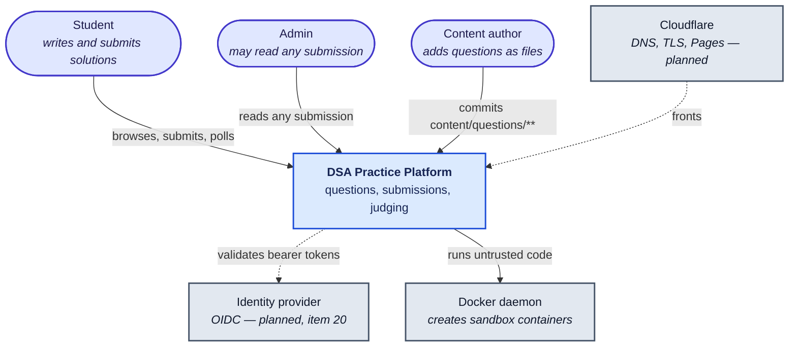
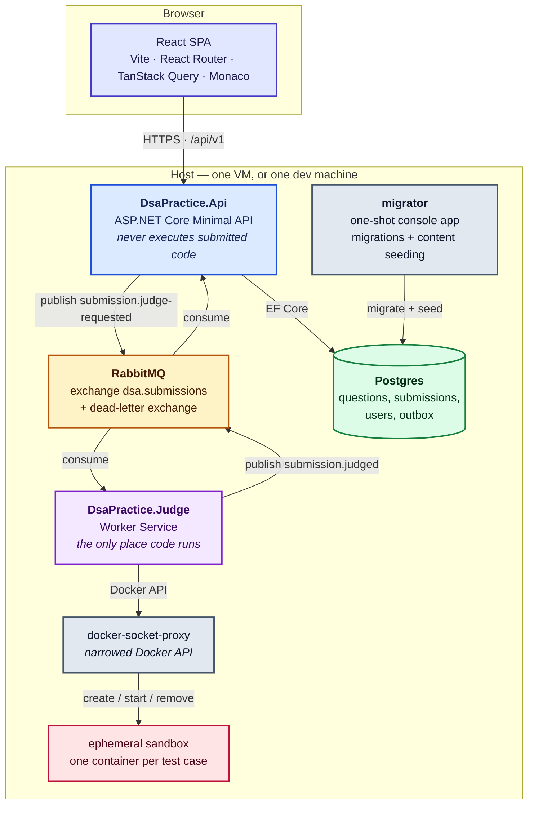
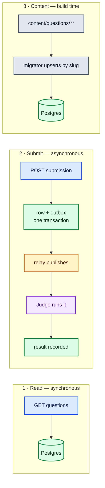

# High-level design

## What this is

A free platform where students practise data-structures and algorithms questions: read a problem,
write a solution in the browser, submit it, and get it judged against test cases within seconds.

Judging is **stdin/stdout**, Codeforces-style, not LeetCode-style function signatures (decision D8).
A submission is a whole program: it reads its input from standard input and prints its answer to
standard output. Since item 19a each question ships a **starter skeleton per language** that already
contains the parsing, so a solver writes the algorithm rather than the I/O.

## The one problem that shapes everything

**Anyone on the internet can make this system execute code they wrote.**

That single fact drives most of the architecture. It is why execution lives in its own process that
the Api cannot reach into, why that process talks to the database not at all, why every run happens
in a container that is destroyed immediately afterwards, and why the request to run code travels as
a message rather than a function call. Remove that constraint and a much simpler design would do.

## Goals and non-goals

| Goal | Consequence in the design |
|---|---|
| Untrusted code never touches the Api or the host | Separate `DsaPractice.Judge` process; ephemeral, capability-stripped containers; no network in the sandbox |
| A submission is never silently lost | Transactional outbox (D6): the row and the message to publish commit together |
| A judged result is never applied twice | Idempotent consumer: a `Completed` submission ignores a duplicate result |
| Hidden test cases stay hidden | Filtered out of the read API; per-test output withheld for hidden cases even in results |
| Free to run | Single small VM, free tiers only (D1, D2); no managed queue, no managed database |
| A student sees a verdict in seconds | Polling, not sockets (D11) — a judge run takes seconds, so a socket earns nothing yet |

**Non-goals for v1**, all deliberate: no leaderboard, no progress tracking, no more than two
languages, no admin UI, no runtime/memory scoring. The project skill caps these; see the roadmap's
item 35 for what is queued behind real users.

## System context

Who and what the platform touches.

Dashed edges are configured but not yet active: the Api validates tokens today, but nothing issues
them until item 20, and enforcement is off behind `Auth:RequireAuthentication`.

## Containers — the runtime pieces

Note what is **missing** from that diagram: there is no arrow from the Judge to Postgres. That is
decision D7 and it is load-bearing — see [module interaction](07-module-interaction.md).

## The three flows

Everything the system does is one of these. Each is drawn step by step in
[sequence diagrams](04-sequence-diagrams.md).

## Quality attributes, and how each is actually met

| Attribute | Mechanism | Where |
|---|---|---|
| **Durability** | Outbox row and submission commit in one transaction; durable exchange, durable queues, persistent messages, publisher confirms | `OutboxWriter`, `RabbitMqPublisher` |
| **Idempotency** | Judge skips a submission it already processed; Api ignores a result for an already-`Completed` submission | `ProcessedSubmissions`, `JudgedResultRecorder` |
| **Isolation** | No network, read-only root, all capabilities dropped, non-root user, pids/memory/CPU caps, tmpfs-only writes, container destroyed after each test case | `DockerSandboxExecutor` |
| **Fairness** | Per-run CPU quota and wall-clock limit; `TimeLimitMultiplier` per language so an interpreter is not judged at compiled speed | `SandboxOptions`, `LanguageRunner` |
| **Confidentiality** | Hidden test cases never leave the read API; hidden results report pass/fail and duration only | `QuestionsService`, `SubmissionsService` |
| **Availability** | A broker outage does not fail a submission — it queues; the Judge waits for the broker rather than failing to start | `OutboxRelay`, `ConnectWithRetryAsync` |
| **Observability** | Serilog structured logging throughout; OpenTelemetry is item 24 and not yet wired | `Program.cs` (both) |

## Consistency model, stated plainly

The system is **eventually consistent** between "submitted" and "judged", and it is
**at-least-once** end to end.

- The outbox publishes at least once: if the broker confirms but the relay crashes before its
  commit, the same message goes out again.
- The Judge acks only after publishing its result: if it dies mid-run, the broker redelivers.
- Therefore a submission **can** be judged twice, and a result **can** arrive twice.

Both duplicates are absorbed rather than prevented — by `ProcessedSubmissions` on the Judge and by
the `Completed` check in `JudgedResultRecorder`. Exactly-once delivery is not attempted, because
it is not achievable across a broker and a database without far more machinery than this earns.

## What is deliberately not built yet

| Not built | Roadmap |
|---|---|
| Real identity provider and SPA login | item 20 |
| Rate limiting and backpressure | item 22 |
| Shared consumer base class in `DsaPractice.Messaging` | item 23 |
| OpenTelemetry tracing across Api → broker → Judge | item 24 |
| Production configuration, hosting, CD, backups | items 25–29 |
| SSE live verdicts, more languages, leaderboard | item 35 |
