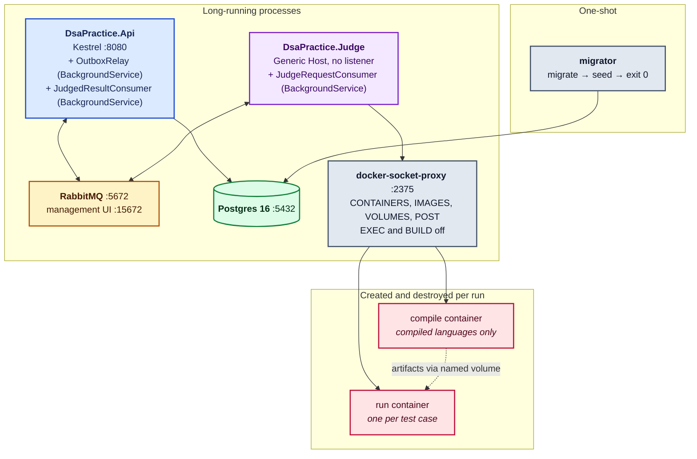
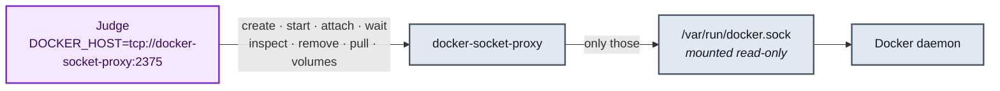
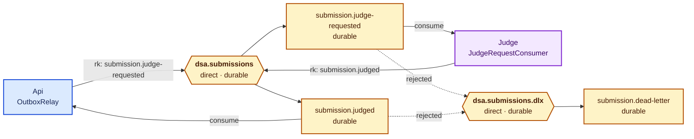
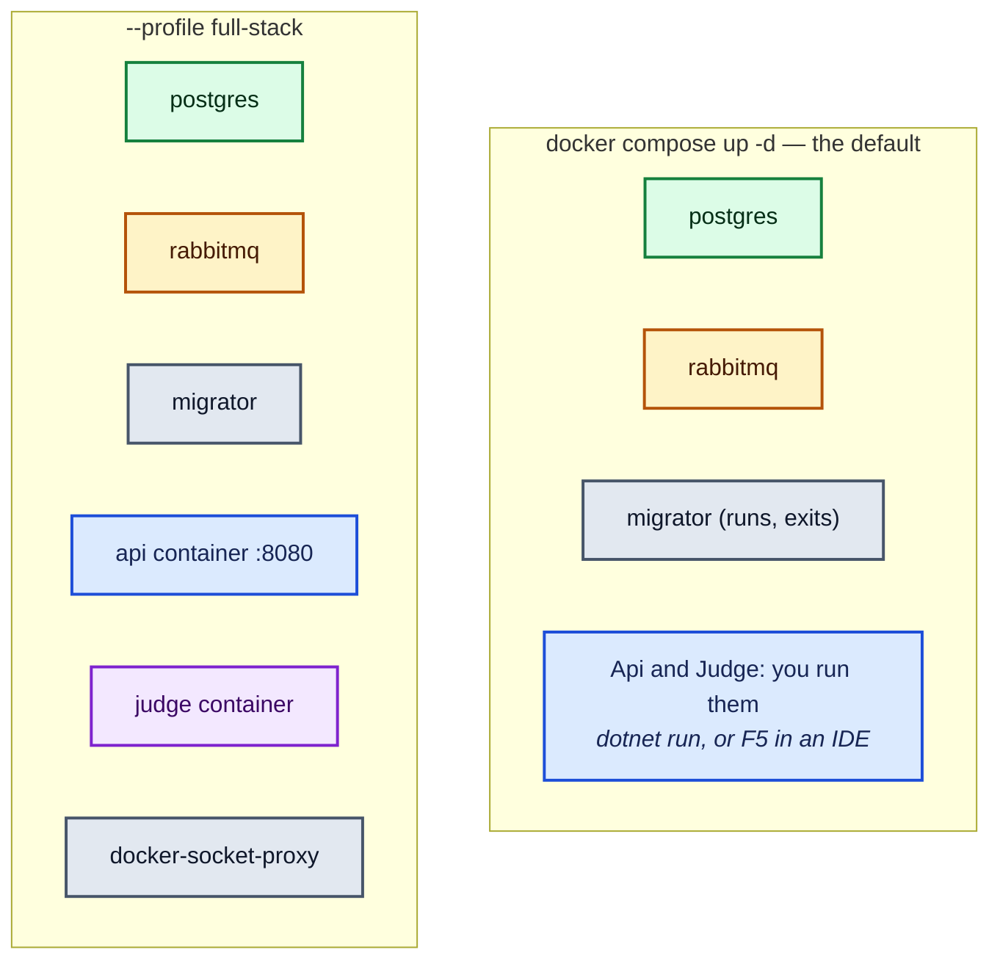
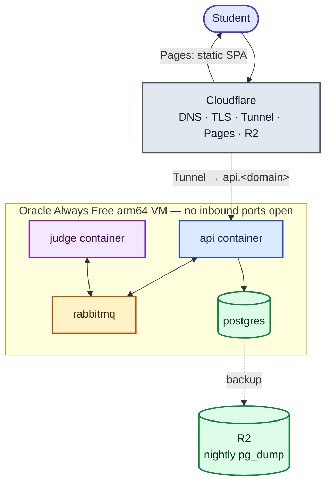
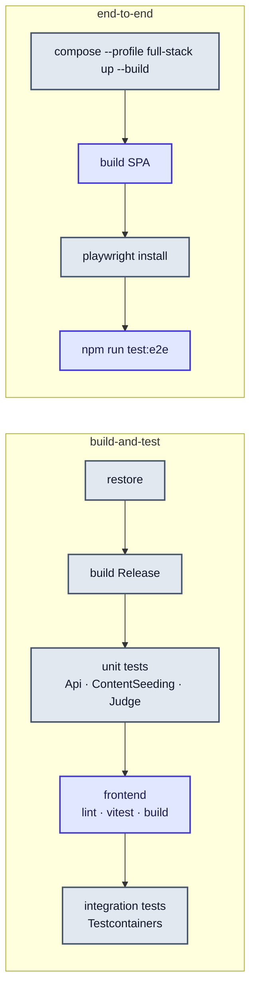

# Architecture and deployment

## Process view

Five processes in a full local stack, plus the sandbox containers the Judge creates and destroys.

The Api hosts **three** things in one process: the HTTP pipeline, the outbox relay, and the result
consumer. The two background services are `BackgroundService` implementations registered with
`AddHostedService`, so they start with the host and stop with it.

## Why the Judge is a separate process

It is the single most important structural decision, so it is worth stating the alternatives that
were rejected.

| Option | Why not |
|---|---|
| Run submissions in the Api process | A sandbox escape, or merely a fork bomb, takes down the thing serving every other student |
| Run them in the Api container via the Docker socket | The Api would hold a root-equivalent handle to the host; a web-facing process should not |
| Synchronous HTTP call to a judging service | Judging takes seconds and can queue; HTTP would hold a request thread open and give no backpressure |

What is built instead: an asynchronous message, a separate process, and a Docker API reached through
a proxy that only exposes the endpoints the Judge actually uses.

## The Docker socket, and why a proxy

The Judge needs the Docker API to create sandboxes. The raw socket is root-equivalent on the host —
anything holding it can start a privileged container with the host filesystem bind-mounted and own
the machine. So the Judge never gets the socket. `tecnativa/docker-socket-proxy` holds it and
exposes a narrowed API:

`EXEC`, `BUILD`, `NETWORKS`, `SWARM`, `SYSTEM`, `SECRETS`, `CONFIGS`, `AUTH` are all **0**. A
compromised Judge cannot exec into a running container, build an image, or read a secret.

## Messaging topology

Declared identically by both services on every connection, by `RabbitMqTopology.DeclareAsync`.
Declaration is idempotent, so whichever process starts first creates it — but RabbitMQ rejects a
redeclaration whose durability or arguments differ (406 `PRECONDITION_FAILED`), which is exactly
why this lives in one shared class rather than once per service.

Both work queues dead-letter to the same parking queue. A message only lands there when a consumer
**rejects** it outright — a payload that will not deserialise, or a failure it decided not to retry.
So anything in `submission.dead-letter` is a signal worth looking at, not routine overflow.

| Setting | Value | Why |
|---|---|---|
| Exchange type | direct, durable | One routing key per message type; survives a broker restart |
| Delivery mode | persistent | Pointless to have a durable queue and non-persistent messages |
| Publisher confirms | on, with tracking | The relay must not mark a row processed for a message the broker never took |
| `mandatory` | true | An unroutable message is a bug, not something to discard quietly |
| Judge prefetch | `Judge:Prefetch`, default 1 | Without it the broker pushes the whole queue at one consumer while others idle |
| Api prefetch | 10 | Recording a result is cheap; judging is not |
| Ack timing | after the result is published | Die mid-run and the broker redelivers rather than losing the submission |

## Local development topology

`docker-compose.yml` has two modes.

The default brings up **infrastructure only**, so you run the two services yourself under a
debugger — that is the everyday loop, and [the debugging guide](../debugging.md) covers it.
`--profile full-stack` additionally builds and runs the app images, which is what you want when
testing the images themselves or running the e2e suite.

Tear down with the same flag: a plain `docker compose down` does not see profiled services, leaves
`api`/`judge` running, and then fails with *"Network … Resource is still in use"*.

## Configuration and secrets

| Setting | Source locally | Source in a deployment |
|---|---|---|
| `ConnectionStrings:DsaPractice` | `dotnet user-secrets` | environment |
| `RabbitMq:Uri` (carries credentials) | `dotnet user-secrets` | environment |
| Postgres/RabbitMQ credentials for compose | gitignored `.env` | n/a |
| `Authentication:Schemes:Bearer` | `dotnet user-jwts` (D4) | the identity provider's settings (item 20) |
| `Submissions:SupportedLanguages` | `appsettings.json` | same |
| `Judge:Sandbox:*` | `appsettings.json` | overridable per deployment |

Nothing that carries a credential is ever in `appsettings.json`. The Api and the migrations project
share one `UserSecretsId`, so `dotnet user-secrets set` against either supplies both.

Every options class is bound with `AddOptions<T>().Bind(...).Validate(...).ValidateOnStart()`, so a
misconfiguration fails at **startup** with a named error rather than at the first request.

## Planned production topology

Not built — items 26–29. Recorded here so the target is visible while reading the rest.

The Tunnel is the point: the VM opens **no** inbound HTTP port, and there is no reverse proxy or
certificate renewal to operate.

## CI

`.github/workflows/dotnet.yml`, two jobs.

Unit tests run before integration tests on purpose: fast feedback without waiting on Docker, and a
unit failure surfaces before paying for the Testcontainers run at all. The e2e suite is its own job
because it builds images and is slower than everything else combined.

> **Accuracy note.** The root README describes CI as "restore → build → test → CodeQL → Docker
> image". The workflow as committed has no CodeQL step and no image-publishing step — the e2e job
> builds images through compose but does not push them. Either the workflow or that sentence should
> change; this document describes the workflow.
