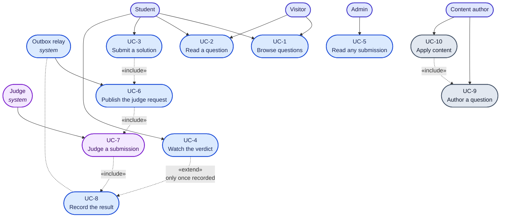

# Use cases

## Actors

| Actor | Who | How the system knows them |
|---|---|---|
| **Visitor** | Anyone, not signed in | No token. Reads questions freely; submitting is offered as "Sign in to submit" |
| **Student** | A signed-in learner | Bearer token; a `Users` row provisioned on first sight from `(iss, sub)` |
| **Admin** | Maintainer | Same, with `Role = Admin` in the `Users` table — never from a token claim |
| **Content author** | Whoever adds questions | Not a runtime actor at all: they commit files and run the migrator |
| **Judge** | The worker process | A system actor; consumes requests and publishes results |
| **Relay** | The Api's outbox background service | A system actor; publishes what the transaction committed |

Two of those deserve a note. **Roles live in the database, not in the token** (D3), so switching
identity provider cannot change who is an admin. And the **content author is not a user of the
running system** — questions are content-as-code (D9), not rows entered through an admin screen,
which is why there is no authoring use case here.

## Use case diagram

---

## UC-1 · Browse questions

**Actor** Visitor or Student · **Endpoint** `GET /api/v1/questions` · **Auth** none

Returns every question as a summary: id, slug, title, difficulty, tags. Ordered by title.

- Never returns statements, test cases or limits — the list page does not need them, and a list
  endpoint that returns everything becomes the reason a page is slow.
- Filtering by difficulty and tag happens **in the browser**: the whole bank is a few dozen rows, so
  a round trip per filter buys nothing. Moving it into SQL is a `WHERE` clause and a GIN index when
  that stops being true.

## UC-2 · Read a question

**Actor** Visitor or Student · **Endpoint** `GET /api/v1/questions/{slug}` · **Auth** none

Returns the statement (markdown), difficulty, tags, time and memory limits, **sample** test cases in
ordinal order, and the **starter code** map keyed by language.

| Rule | Enforced by |
|---|---|
| Hidden test cases are never returned | `QuestionsService` filters `!tc.IsHidden` in the query itself |
| A malformed slug 404s before any query runs | Route constraint `{slug:maxlength(100):regex(...)}` + `UseStatusCodePages` |
| An unknown slug 404s as `ProblemDetails` | `NotFoundException` → `GlobalExceptionHandler` |
| Starters absent for a language is not an error | Map simply has no key; the SPA falls back to a generic comment |

Two different mechanisms produce that 404 — a routing miss that never throws, and a thrown
`NotFoundException`. Both must produce the same `api.error.notfound` body; see
[low-level design](08-low-level-design.md#error-handling).

## UC-3 · Submit a solution

**Actor** Student · **Endpoint** `POST /api/v1/submissions` · **Auth** required once item 20 lands

Request is `{ questionId, language, sourceCode }`. **There is no `userId` field** — who is submitting
is decided by the caller's identity, never by something the caller can set (D3).

**Preconditions**

1. `language` is in `Submissions:SupportedLanguages` — edge validation, FluentValidation, 400.
2. `sourceCode` is non-empty — edge validation, 400.
3. The question exists — business validation in `SubmissionsService`, 404.

**Main flow**

1. Validate shape; reject with 400 + `ProblemDetails` listing every field error at once.
2. Load the question **with its test cases**, hidden ones included — they travel in the message (D7).
3. Get or create the caller's `Users` row (just-in-time provisioning).
4. Build the `Submission` row, `Status = Pending`.
5. Stage `SubmissionJudgeRequested` on the **same** `DbContext`.
6. One `SaveChanges` commits both.
7. Return **201** with the submission.

**The guarantee.** Step 6 is why a broker outage cannot fail a submission. Nothing in this flow talks
to RabbitMQ at all. Before the outbox (item 7) the row was committed and *then* published, so an
outage meant a 500 for a submission that had in fact been saved.

## UC-4 · Watch the verdict

**Actor** Student · **Endpoint** `GET /api/v1/submissions/{id}` · **Auth** owner or admin

The SPA polls once a second and **stops** when `status === 'Completed'` (D11). A socket buys nothing
when a judge run takes seconds; SSE is queued as item 35.

| Rule | Why |
|---|---|
| Owner-or-admin, enforced by `SubmissionOwnershipFilter` | Submissions are someone's work |
| Someone else's submission returns **404, not 403** | 403 confirms the id exists |
| Hidden results carry `passed` and duration, never output or error text | Otherwise hidden tests are reconstructible one submission at a time |
| `verdict` is non-null exactly when `status` is `Completed` | A database check constraint, not just a convention |

The ownership rule is an **endpoint filter**, not an authorization policy, because it needs the row
loaded to evaluate — a declarative policy cannot express that without a resource-based handler,
which is more machinery than one endpoint justifies.

## UC-5 · Read any submission

**Actor** Admin

Same endpoint. `SubmissionOwnershipFilter` lets `Role == Admin` through for any owner. The role is
read from the `Users` table.

## UC-6 · Publish the judge request

**Actor** Outbox relay (system)

Every `PollInterval`, claim up to `BatchSize` due rows with `FOR UPDATE SKIP LOCKED`, publish each,
mark it processed. Failure backs off exponentially and records the error on the row. Processed rows
are purged hourly past `Retention`. Full algorithm in [low-level design](08-low-level-design.md).

## UC-7 · Judge a submission

**Actor** Judge (system)

Consume `submission.judge-requested`, run the code in sandboxes, aggregate a verdict, publish
`submission.judged`, **then** ack.

| Rule | Why |
|---|---|
| A payload that will not deserialise is rejected without requeue | Nothing about it improves by retrying |
| A submission already judged by this instance is acked, not re-run | Redelivery guard, `ProcessedSubmissions` |
| A Judge-side failure still publishes `InternalError` | A submission stuck `Running` forever is worse for the student than an honest error |
| Ack happens **after** the result is published | Die in between and the broker redelivers |
| Test cases stop at the first failure | The verdict is already decided; the rest is spent sandbox time |

## UC-8 · Record the result

**Actor** Api's `JudgedResultConsumer` (system)

| Case | Outcome |
|---|---|
| Submission found and `Pending` | Status → `Completed`, verdict, timestamp, per-test rows written; ack |
| Submission already `Completed` | Left exactly as it is; ack — this is the duplicate-delivery path |
| Submission unknown | Logged and acked — nothing to apply it to, and retrying will not conjure it |

## UC-9 · Author a question

**Actor** Content author · **Not a runtime use case**

One folder per question under `content/questions/<slug>/`: `question.json`, `statement.md`,
`starters/<language>.<ext>`, `tests/sample/NN.in|.out`, `tests/hidden/NN.in|.out`, and a
`solutions/reference.py` the seeder ignores.

Ordinals are assigned **by the loader** — samples first, then hidden, each in filename order — so
authors never hand-number across two folders and collide on the unique index.

## UC-10 · Apply content

**Actor** Content author, via `docker compose run --rm migrator`

Migrate, then upsert every question by slug, in one pass.

| Property | Meaning |
|---|---|
| **Idempotent** | Unchanged content writes nothing; re-running costs nothing |
| **In-place** | Matched by slug and ordinal, so ids survive an edit — submissions point at them |
| **Non-destructive** | A question in the database but absent from content is left alone, never deleted |
| **All-or-nothing validation** | Every broken question is reported in one message, before anything is written |
