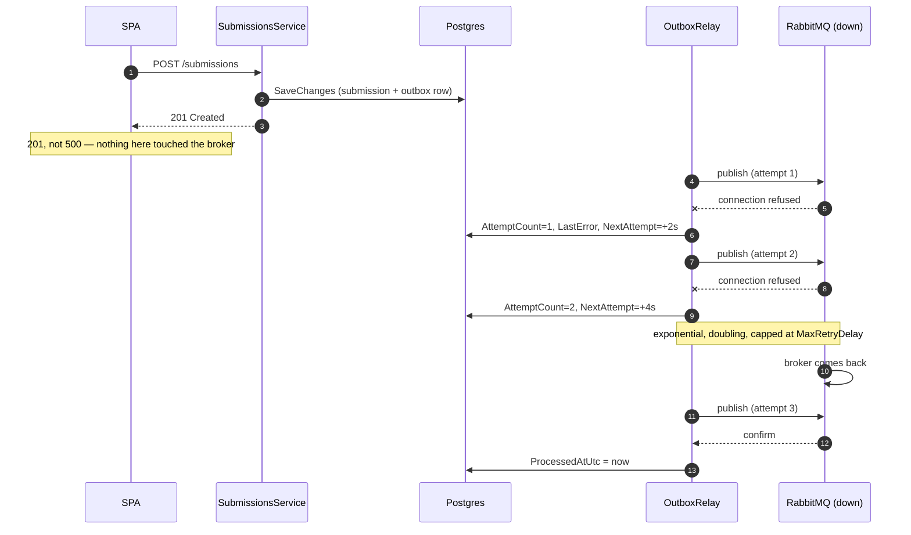
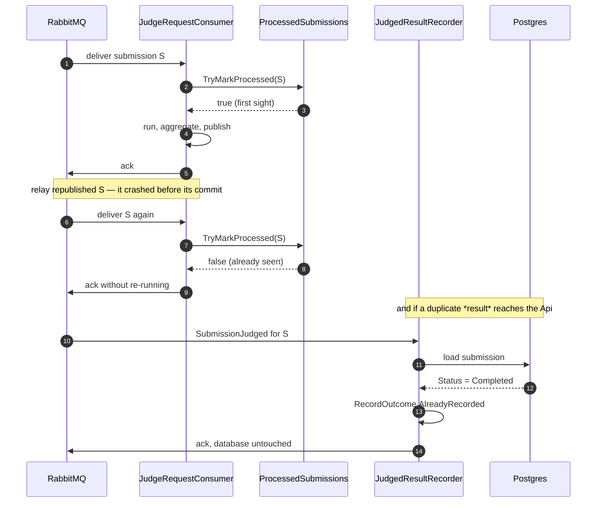
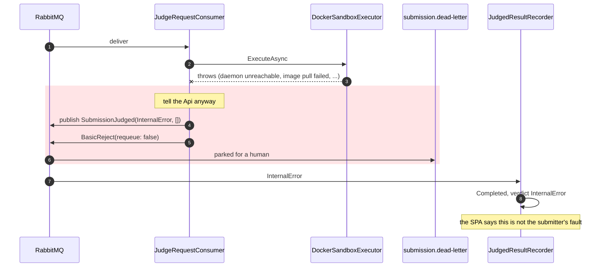
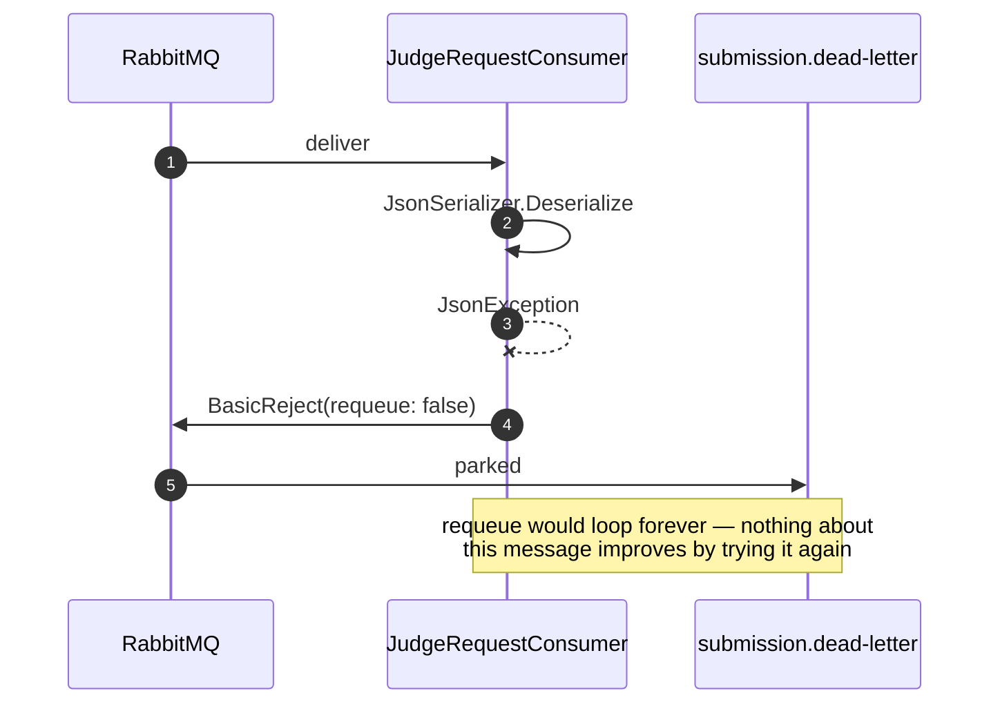
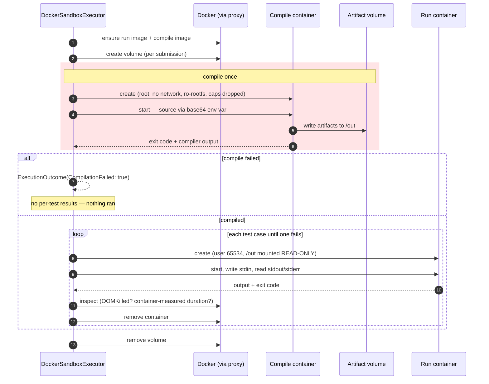
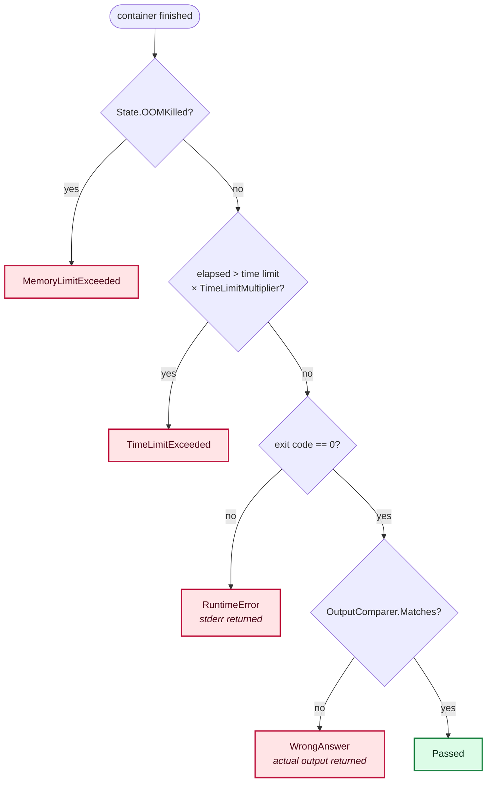
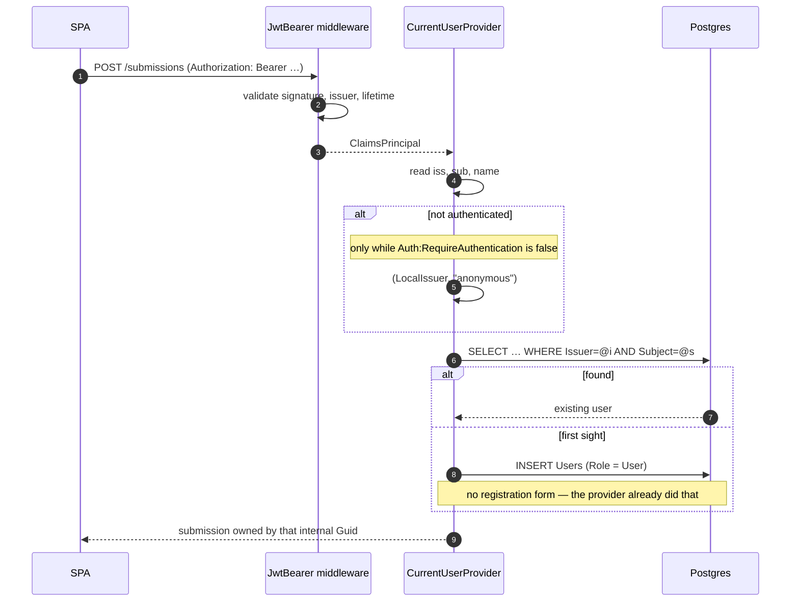
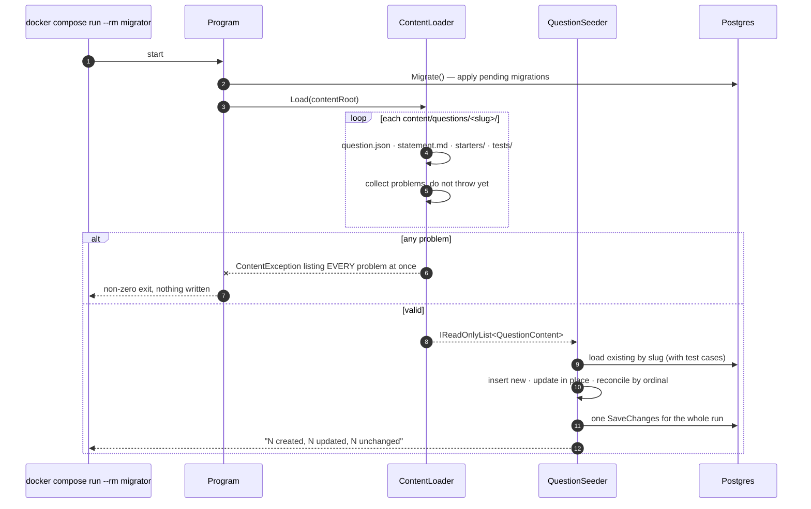
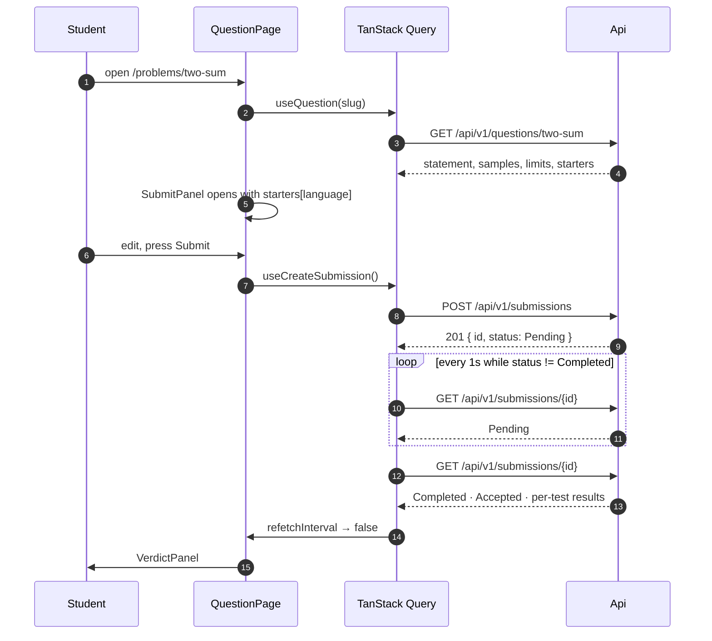

# Sequence diagrams

The interesting behaviour here is asynchronous, so these are the fastest route into the codebase.
Each diagram names the real types; find them in [class diagrams](05-class-diagrams.md).

## 1 · Submitting a solution — the happy path

End to end, from the click to the verdict on screen.

```mermaid
sequenceDiagram
    autonumber
    participant SPA as SubmitPanel (SPA)
    participant EP as SubmissionsEndpoints
    participant SVC as SubmissionsService
    participant DB as Postgres
    participant RLY as OutboxRelay
    participant MQ as RabbitMQ
    participant JC as JudgeRequestConsumer
    participant EX as DockerSandboxExecutor
    participant SBX as Sandbox container
    participant RC as JudgedResultRecorder

    SPA->>EP: POST /api/v1/submissions
    EP->>EP: FluentValidation (shape)
    EP->>SVC: CreateSubmissionAsync
    SVC->>DB: load Question + ALL test cases
    SVC->>DB: get or create Users row
    SVC->>SVC: build Submission (Pending)
    SVC->>SVC: OutboxWriter.Enqueue(same DbContext)

    rect rgb(220, 252, 231)
        Note over SVC,DB: ONE transaction — submission + message
        SVC->>DB: SaveChangesAsync
    end

    SVC-->>EP: SubmissionResponse
    EP-->>SPA: 201 Created

    Note over SPA: polls GET /submissions/{id} every 1s

    RLY->>DB: claim due rows (FOR UPDATE SKIP LOCKED)
    RLY->>MQ: publish submission.judge-requested
    MQ-->>RLY: publisher confirm
    RLY->>DB: ProcessedAtUtc = now

    MQ->>JC: deliver (prefetch 1, autoAck false)
    JC->>JC: ProcessedSubmissions.TryMarkProcessed
    JC->>EX: ExecuteAsync(request)

    loop each test case, in ordinal order
        EX->>SBX: create (no network, ro-rootfs, caps dropped)
        EX->>SBX: start + write stdin
        SBX-->>EX: stdout / stderr / exit code
        EX->>SBX: remove
        Note over EX: stop at the first failure
    end

    EX-->>JC: ExecutionOutcome
    JC->>JC: VerdictAggregator.Aggregate
    JC->>MQ: publish submission.judged
    JC->>MQ: BasicAck (only now)

    MQ->>RC: deliver
    RC->>DB: Completed + verdict + per-test rows
    RC->>MQ: BasicAck

    SPA->>EP: GET /submissions/{id}
    EP-->>SPA: Completed · Accepted
```

Two things to notice. The green band is the whole durability guarantee — one `SaveChanges`, not two
operations that can disagree. And the Judge's `BasicAck` is the **last** thing it does, after the
result is safely published.

## 2 · The broker is down

The case the outbox exists for. The student sees no difference.

Before item 8 this returned **500** for a submission that had in fact been saved. The behaviour above
was verified against a real outage, not reasoned about.

## 3 · Redelivery — the same submission judged twice

At-least-once is the contract, so this path must be harmless.

Two independent guards, because `ProcessedSubmissions` is a bounded **in-memory** cache on one Judge
instance: it does not survive a restart and does not span instances. The database check in
`JudgedResultRecorder` is the one that always holds.

## 4 · The Judge itself fails

Distinct from the submitted code failing. The student must not be left watching a spinner.

A submission stuck `Running` forever is worse for the student than an honest `InternalError`. The
original message is parked rather than retried, so the failure is visible instead of swallowed.

## 5 · A bad payload

The same applies to a message that deserialises but has no `SubmissionId`.

## 6 · Inside the sandbox — a compiled language

C# needs a compile step; Python does not. Compiling happens **once per submission**, not once per
test case.

Why the compile container runs as **root** when run containers never do: a Docker volume is created
root-owned, so nothing else could write artifacts into it. The trade-off is narrow and deliberate —
that container has no network, no capabilities and a read-only root filesystem, and it runs a
compiler, not the submission. The submission only ever *runs* as `65534:65534`, with `/out` mounted
read-only.

## 7 · How a verdict is decided for one test case

There is also an earlier exit: if reading the container's output exceeds *time limit + startup
grace*, the read is cancelled and the case is `TimeLimitExceeded` without waiting for the container
at all.

Duration is measured from the **container's own** start and finish times, not the wall clock around
the whole call. Creating and starting a container costs hundreds of milliseconds, and charging the
submitter for the daemon's overhead would fail correct solutions on a busy host. The wall clock still
governs when the container is killed.

## 8 · Just-in-time user provisioning

The submission stores the **internal** `Guid`, never the provider's `sub` (D3). Switching identity
provider therefore cannot orphan anyone's history.

## 9 · Applying content

Reporting every broken question at once is deliberate: a seeder that fails on the first problem, is
fixed, then fails on the next is a slow way to find out the content is wrong.

## 10 · The SPA's read and poll cycle

`refetchInterval` returning `false` on `Completed` is what stops the poll — decision D11, and the
reason an idle question page makes no requests at all.
