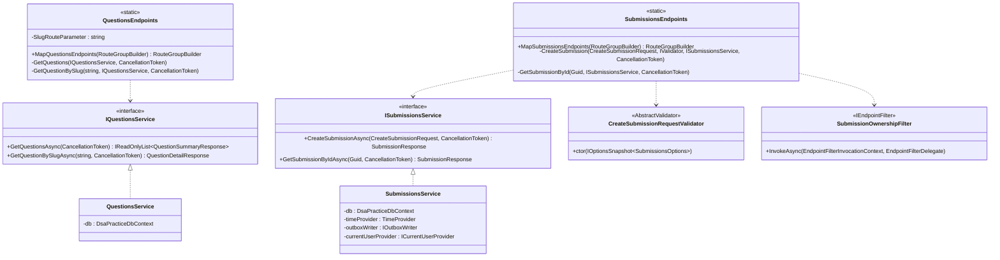
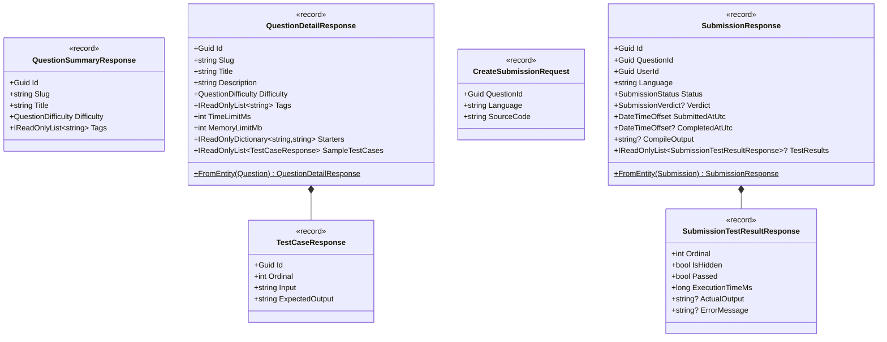
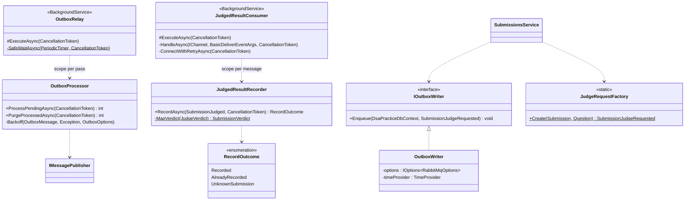
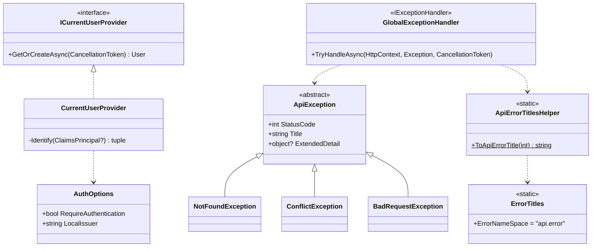
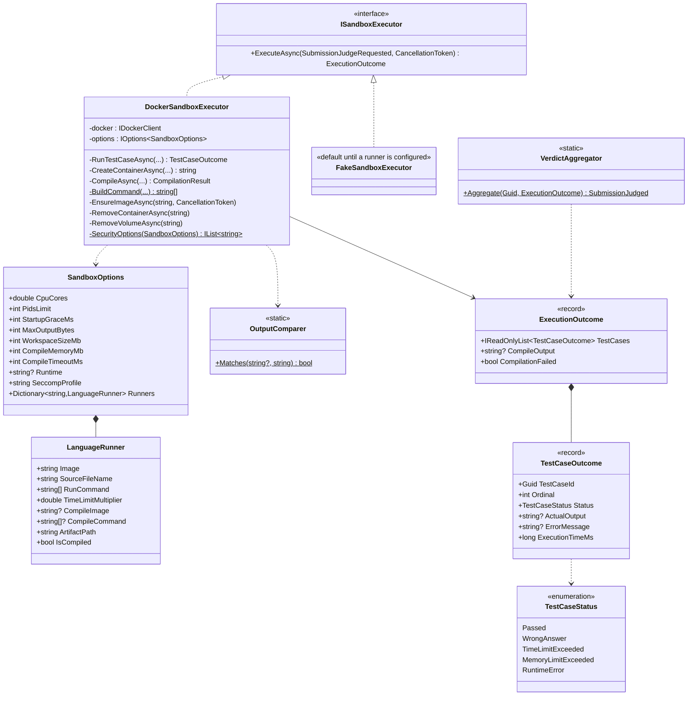
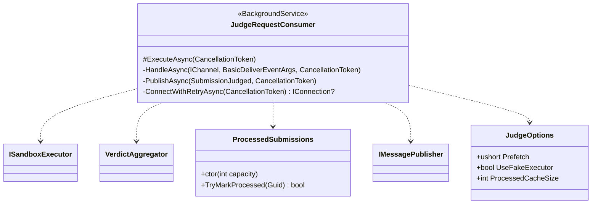
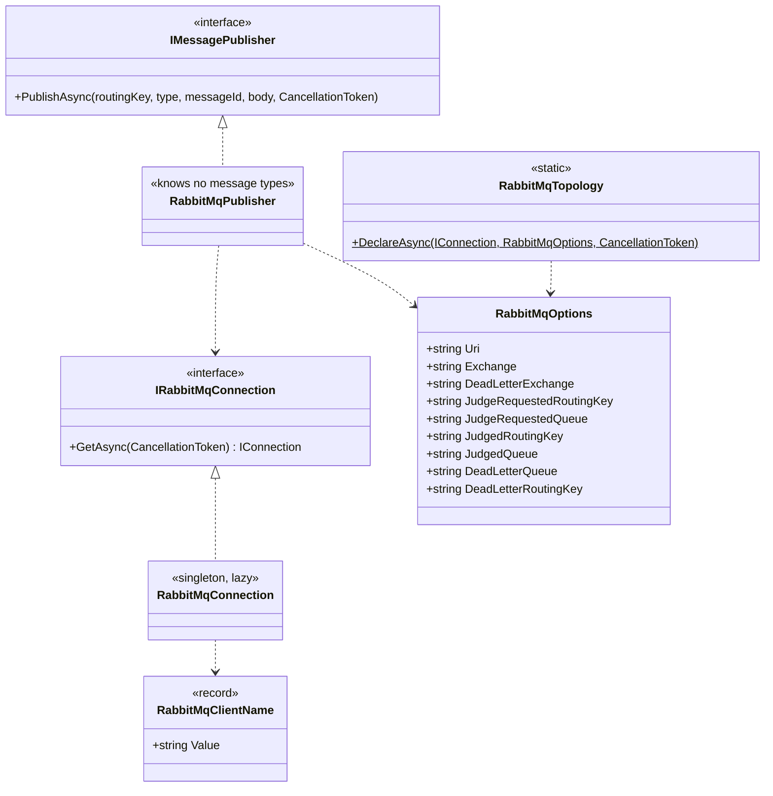
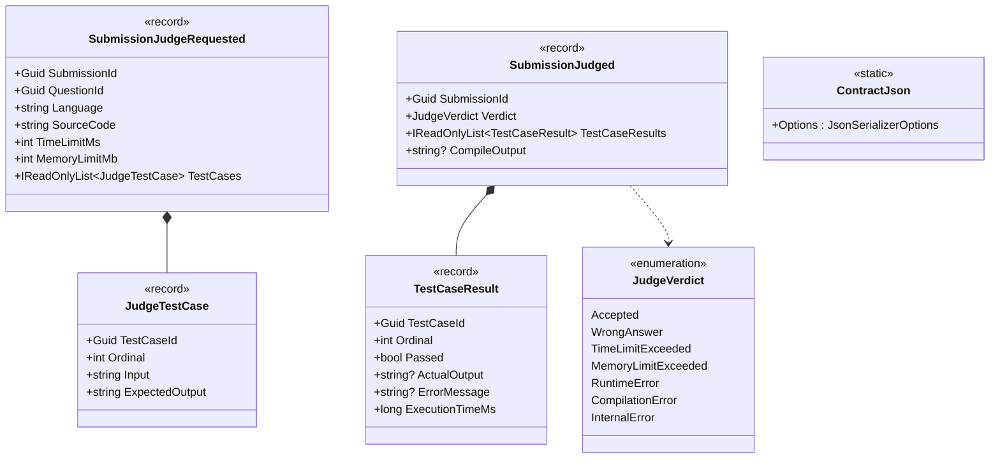
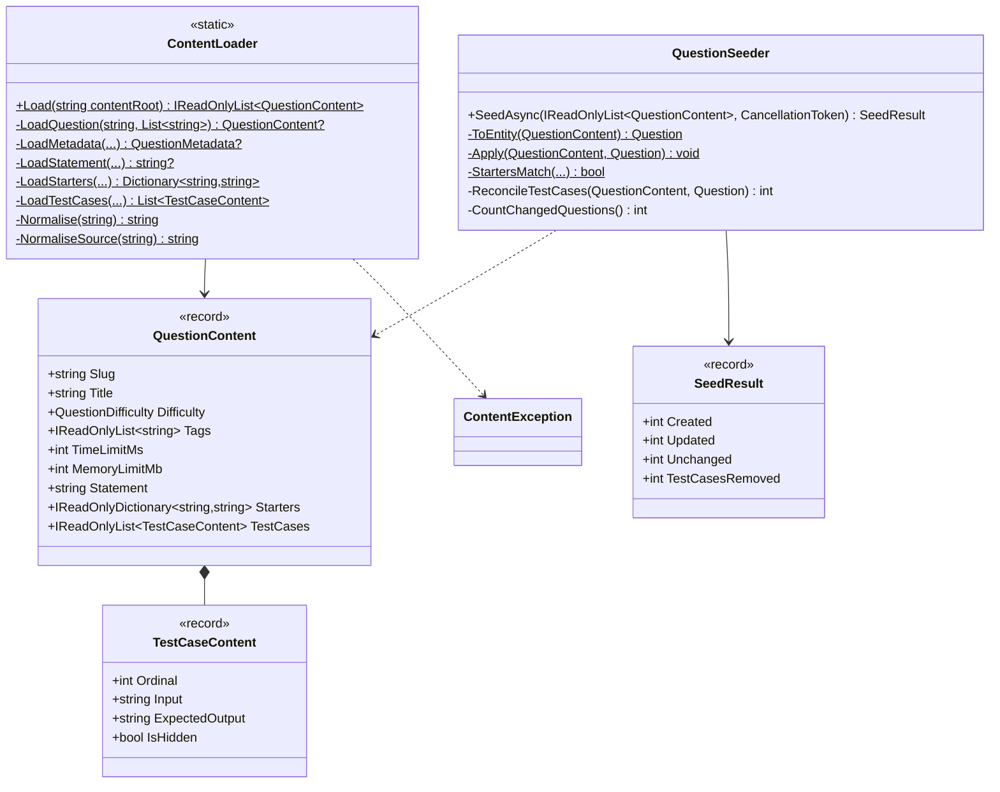
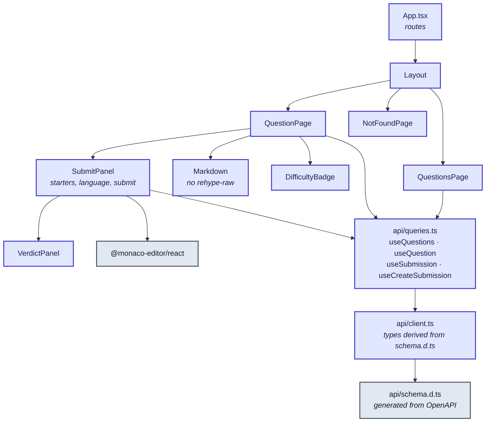

# Class diagrams

Every type here exists at the path given. Visibility follows the project convention: `internal`
unless something outside the assembly must see it, and only `Program` is public in the Api.

## DsaPractice.Api — HTTP layer

Endpoints are thin adapters: parse, call a service, map to `Results.*`. They never touch
`DbContext`.

`SubmissionsService` shows the convention for a business service: `DbContext` injected directly
(Scoped, matching `DbContext`'s own lifetime), guard clauses that throw first, happy path last. No
repository — a blind wrapper over `DbSet<T>` re-exposes its surface for no gain.

## DsaPractice.Api — DTOs

Records, not classes. Immutable by default.

`CreateSubmissionRequest` has **no `UserId`** — that is the design, not an omission.
`SubmissionTestResultResponse` carries `ActualOutput` and `ErrorMessage` as null for a hidden case:
the student learns that it failed, never what it contained.

## DsaPractice.Api — outbox and result consumer

`OutboxProcessor` is split from `OutboxRelay` so one pass can be driven directly — by a test, or
later by anything that wants to flush on demand. Both background services create a **scope per unit
of work** via `IServiceScopeFactory`: a `BackgroundService` has no ambient request scope to borrow a
`DbContext` from. That is the correct use of the pattern, as opposed to a singleton service pulling
scoped dependencies out of the container per method.

## DsaPractice.Api — auth and errors

The hierarchy is shaped by **HTTP semantics, not by entity** — `NotFoundException("Question '…' was
not found.")`, never `QuestionNotFoundException`. Title strings have exactly one source:
`ToApiErrorTitle(statusCode)`, called both by the exception constructors and by the
`CustomizeProblemDetails` callback that handles responses nothing threw for.

## DsaPractice.Judge — execution

The verdict is derived by `VerdictAggregator` rather than decided by the executor, so the rule lives
in one testable place regardless of which executor ran — which is what makes `FakeSandboxExecutor`
and `StubSandboxExecutor` useful rather than a parallel implementation of the rules.

## DsaPractice.Judge — messaging

`ConnectWithRetryAsync` is why the Judge waits for the broker instead of failing to start: it has
nothing to do without one, unlike the Api, which still serves questions perfectly well.

Note that `JudgeOptions` does **not** nest `SandboxOptions`, even though the configuration sections
are `Judge` and `Judge:Sandbox`. They are bound and validated independently in `Program.cs`, so the
consumer takes `IOptions<JudgeOptions>` and the executor takes `IOptions<SandboxOptions>` — neither
drags the other's settings along.

## DsaPractice.Messaging — shared transport

`RabbitMqPublisher` takes an already-serialized body and a routing key. It knows nothing about
message types on purpose — the outbox row carries the routing key, type and payload, so the relay
needs no per-type knowledge either.

**Known gap:** this assembly is publish-side only, so both consumers hand-roll the same ~67 lines of
connect-with-retry, channel setup and deserialize-or-dead-letter. A `RabbitMqConsumer<TMessage>`
base class is roadmap item 23; the ack decision deliberately stays with the handler, because it is
business policy rather than transport.

## DsaPractice.Contracts — the wire

`SubmissionJudgeRequested` carries **every** test case, hidden ones included. Hiding test cases is a
read-API rule, not a judging one — and the Judge cannot look them up, because it has no database
(D7).

`JudgeVerdict` mirrors the Api's `SubmissionVerdict` **by name rather than sharing the type**, and
`JudgedResultRecorder.MapVerdict` is an explicit `switch` rather than a name parse: the two enums are
allowed to drift, and a new value on either side should be a compile error, not a silent mismatch.

## DsaPractice.ContentSeeding

`CountChangedQuestions` reads EF's change tracker rather than comparing by hand, which is what makes
"unchanged content writes nothing" true rather than aspirational. `StartersMatch` exists for the same
reason: a `jsonb` map that round-trips with its keys in a different order is the same starter set,
and rewriting it would report every question as updated on every run.

## Frontend — component and data flow

`schema.d.ts` is generated from the running Api's OpenAPI document and committed, so a contract
change breaks the **build** rather than the page. `Markdown` deliberately omits `rehype-raw`, so a
question statement cannot inject markup.
