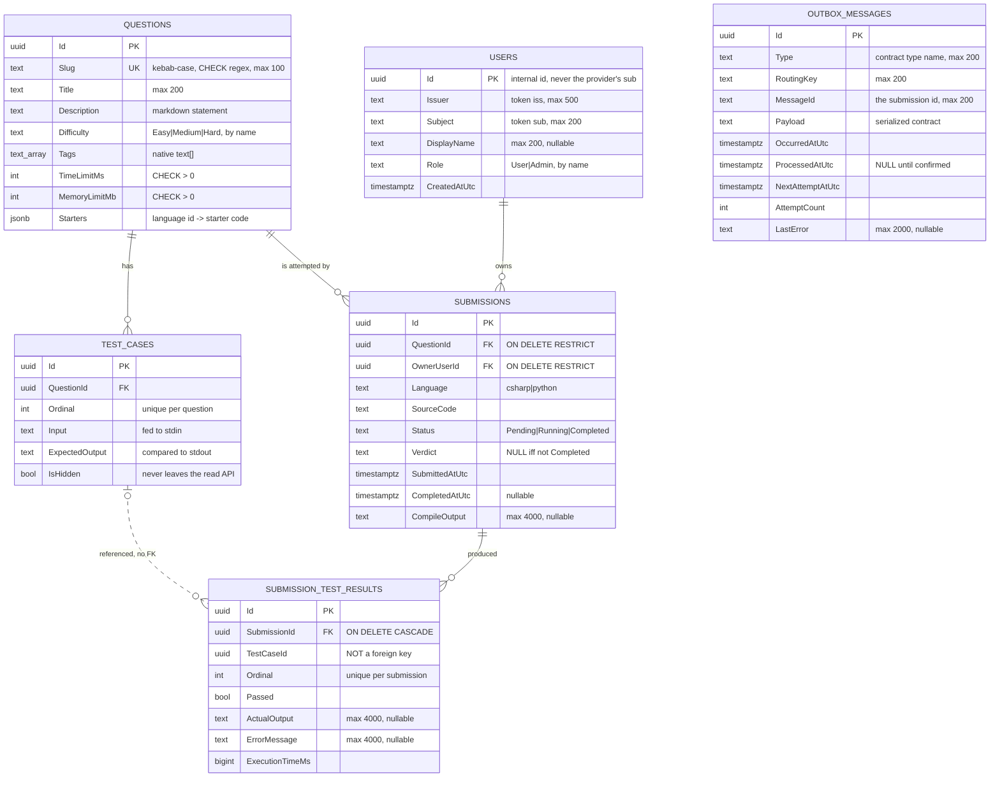
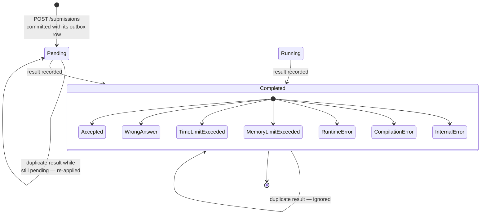

# Data model

Postgres 16. One schema, six tables. Entities live in `DsaPractice.DataAccess/Entities/`, mapping in
`Configurations/`, one `IEntityTypeConfiguration<T>` per entity, applied by
`ApplyConfigurationsFromAssembly`.

## Entity relationships



`OUTBOX_MESSAGES` has no relationships on purpose. It is a transport table, not domain data — the
relay reads it knowing nothing about what a `SubmissionJudgeRequested` is.

## The three modelling decisions worth explaining

### 1 · `SubmissionTestResults.TestCaseId` is not a foreign key

Deliberate. A test case can be **removed from the content** while old submissions still record what
it did. A foreign key would force a choice between deleting history and never changing a question's
tests, and both are wrong.

Consequence: `IsHidden` cannot be joined from a deleted test case, so `SubmissionsService` looks up
the question's hidden ids separately and redacts on the way out.

### 2 · `Tags` is `text[]` and `Starters` is `jsonb`, not child tables

Both are small collections always read with their question and never queried independently. A join
table would add two queries and an index for nothing. `Tags` maps to a native Postgres `text[]` by
Npgsql convention; add a GIN index if tag filtering ever moves into SQL. `Starters` is `jsonb` with
an explicit EF value converter — see below.

### 3 · Enums are stored by name

`Difficulty`, `Status`, `Verdict`, `Role` are all `HasConversion<string>()`. Readable in `psql`, and
reordering enum members cannot silently change what an existing row means.

The one side effect: `ORDER BY "Difficulty"` sorts alphabetically — Easy, Hard, Medium. Sort in code
or map to a rank if difficulty ordering ever moves into a query.

## Constraints

Invariants live in Postgres, not only in C#. The seeder and the Judge result consumer both bypass the
Api's validators, so a rule that exists only in a validator is not a rule.

| Constraint | Definition | Stops |
|---|---|---|
| `CK_Questions_Slug_Format` | `"Slug" ~ '^[a-z0-9]+(-[a-z0-9]+)*$'` | A slug that could never be routed |
| `CK_Questions_TimeLimitMs_Positive` | `"TimeLimitMs" > 0` | A question nothing can pass |
| `CK_Questions_MemoryLimitMb_Positive` | `"MemoryLimitMb" > 0` | Same |
| `CK_Submissions_Verdict_OnlyWhenCompleted` | `("Status" = 'Completed') = ("Verdict" IS NOT NULL)` | A verdict on a pending row, or a completed row without one |
| `IX_Questions_Slug` unique | | Two questions on one URL |
| `IX_Users_Issuer_Subject` unique | | Two rows for one person at one provider |
| `IX_TestCases_QuestionId_Ordinal` unique | | Two test cases claiming the same position |
| `IX_SubmissionTestResults_SubmissionId_Ordinal` unique | | The same, per submission |
| FK `Submissions → Questions` | `ON DELETE RESTRICT` | Deleting a question out from under its submissions |
| FK `Submissions → Users` | `ON DELETE RESTRICT` | Orphaning submissions |
| FK `SubmissionTestResults → Submissions` | `ON DELETE CASCADE` | Orphan result rows |

The slug regex appears **twice on purpose** — as this check constraint and as the Api's route
constraint — from one `Question.SlugPattern` constant. A malformed slug can therefore neither be
stored nor routed.

## Indexes, and the query each serves

| Index | Query |
|---|---|
| `IX_Questions_Slug` (unique) | `GET /questions/{slug}` |
| `IX_TestCases_QuestionId_Ordinal` (unique) | Load a question's test cases in run order. Leading column is `QuestionId`, so it serves the FK lookup too — EF drops its convention-created single-column index in favour of it |
| `IX_Users_Issuer_Subject` (unique) | The lookup every authenticated request makes |
| `IX_SubmissionTestResults_SubmissionId_Ordinal` (unique) | Results are always read for one submission, in run order |
| `IX_OutboxMessages_Pending` (filtered) | The relay's only query |
| `IX_OutboxMessages_ProcessedAtUtc` | The hourly retention sweep |

The outbox index is worth a closer look:

```sql
CREATE INDEX "IX_OutboxMessages_Pending"
    ON "OutboxMessages" ("NextAttemptAtUtc", "OccurredAtUtc")
    WHERE "ProcessedAtUtc" IS NULL;
```

The filter is the point. Processed rows are the overwhelming majority over time and are never looked
up through this index, so excluding them keeps it small — roughly proportional to the backlog rather
than to everything ever published.

## The `Starters` column

`Dictionary<string, string>` → `jsonb`, added in `20260916190001_QuestionStarters`:

```sql
ALTER TABLE "Questions" ADD "Starters" jsonb NOT NULL DEFAULT ('{}'::jsonb);
```

Two details that are easy to get wrong:

- **The default is for the migration, not for inserts.** The column is `NOT NULL` on a table that
  already had rows, so adding it without one fails outright.
- **An explicit EF value converter**, not Npgsql's `EnableDynamicJson()`. That opt-in lives on the
  *data source*, so every host that builds one — Api, migrator, tests — would have to remember it or
  fail at runtime with `InvalidCastException`. The converter keeps the decision in
  `QuestionConfiguration`, where the column is defined. A `ValueComparer` comes with it: a dictionary
  is a mutable reference type, and without one a starter edited in place would never be detected as a
  change.

## Submission lifecycle



`Status` only moves forward. `Verdict` is set exactly when `Status` becomes `Completed` — enforced by
the check constraint, not by convention.

> **Note on `Running`.** The enum has it and the constraint allows it, but nothing writes it today:
> the Judge does not report that it has picked a submission up. A submission goes `Pending` →
> `Completed`. Wiring `Running` is part of the judging-progress work in roadmap item 25a, which needs
> the Judge to emit progress at all.

## Migrations

Applied by the one-shot `migrator`, never by the Api at startup. Generated with `dotnet ef`, never
hand-edited — a needed default or column type goes in the model so the generated SQL is right.

| Migration | Added |
|---|---|
| `20260818121027_InitialCreate` | First schema |
| `20260911110606_QuestionContentModel` | Slug, tags, limits, check constraints — the shape content fills |
| `20260914133839_OutboxMessages` | Outbox table and its two indexes |
| `20260914171325_SubmissionResults` | Per-test-case results, compile output |
| `20260914183311_UsersAndSubmissionOwnership` | `Users`, `Submissions.OwnerUserId` |
| `20260916190001_QuestionStarters` | `Questions.Starters` jsonb |

Both halves of the migrator are idempotent, so re-running after pulling a migration or editing
content costs nothing:

```bash
docker compose run --rm migrator
```

## Retention

| Data | Policy |
|---|---|
| Questions and test cases | Kept. Absent-from-content is never deleted — remove it deliberately in SQL |
| Submissions and results | Kept indefinitely; account deletion is roadmap item 21 |
| Outbox, processed rows | Deleted past `Outbox:Retention` (default 7 days) by an hourly sweep |
| Outbox, unprocessed rows | Never deleted — they are work not yet done |
