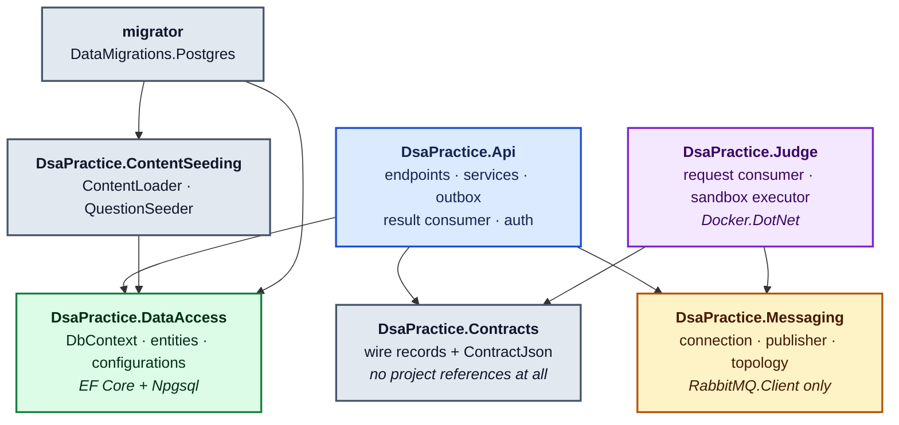
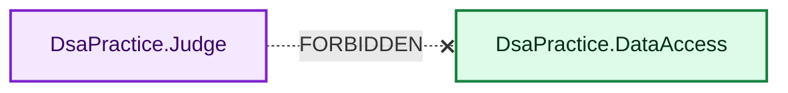
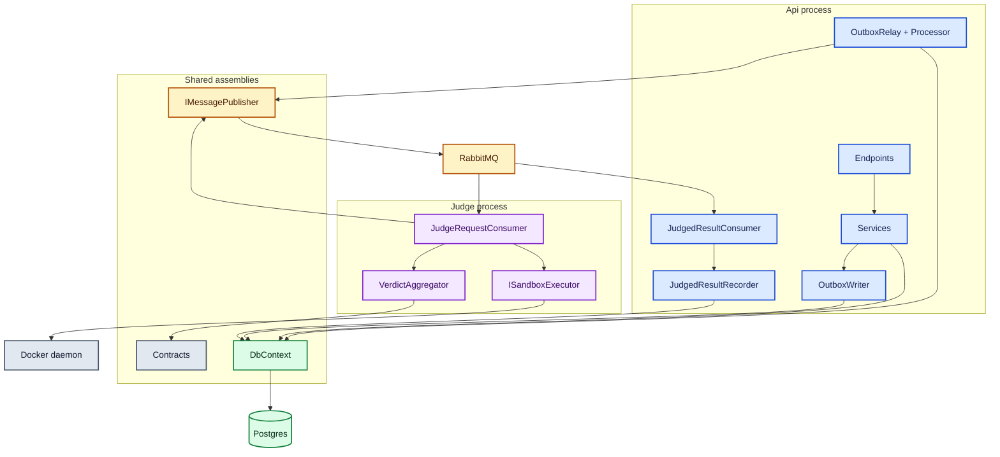
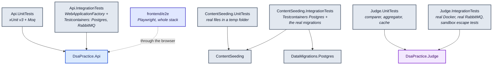

# Module interaction

## The assembly graph

Six production assemblies. Every edge is a `ProjectReference`; the arrows are the whole dependency
story.

## The edge that is not there

**`DsaPractice.Judge` does not reference `DsaPractice.DataAccess`.** That is decision D7, and it is
the most important fact on this page.

Consequences that follow from that one missing reference:

- `SubmissionJudgeRequested` must be **self-contained** — the code, the language, the limits and
  *every* test case including hidden ones. The Judge cannot look anything up.
- Hiding test cases is a **read-API rule, not a judging rule**. `QuestionsService` filters them;
  the message does not.
- `JudgeVerdict` mirrors `SubmissionVerdict` by name rather than sharing the type, because sharing it
  would mean referencing the assembly it lives in.
- The Judge is the process most likely to be compromised, and it holds no database credential at all.

The cost is recorded honestly in the README: a message carrying Two Sum's largest hidden test is
around **290 KB**. Fine for RabbitMQ at this scale; revisit if test data grows.

## Dependency rules

| Rule | Why | How it is enforced |
|---|---|---|
| Judge must not reference DataAccess | D7, above | No `ProjectReference`; the build fails if someone adds a `using` |
| Api must not reference Docker or sandbox logic | Executing code is the Judge's job only | No `Docker.DotNet` package reference in the Api |
| Contracts must reference nothing | A wire contract should change only when the contract changes | Its `.csproj` has no `ProjectReference` at all |
| Messaging must not know message types | The outbox row carries routing key, type and payload | `IMessagePublisher` takes `ReadOnlyMemory<byte>` |
| Endpoints must not touch `DbContext` | Endpoints are HTTP adapters; services own domain rules | Convention, visible in review |
| Only `Program` is public in the Api | Tests reach internals via `InternalsVisibleTo` | Convention |

The first four are structural — you cannot violate them without editing a `.csproj`, which is
exactly the point. The last two are conventions and depend on review.

## Runtime interaction, by concern

Assembly references say what *can* talk to what. This is what actually does, and through what.

Note that `OutboxWriter` writes through the **caller's** `DbContext` rather than opening its own.
That is the entire mechanism: the message and the submission are on one change tracker, so one
`SaveChanges` commits both.

## Service lifetimes

Getting these wrong is how you get a `DbContext` shared across requests, or two services in one
request that do not share a transaction.

| Registration | Lifetime | Why |
|---|---|---|
| `DsaPracticeDbContext` | Scoped | One per request, disposed with it |
| `QuestionsService`, `SubmissionsService` | Scoped | Match `DbContext`; share one change tracker per request |
| `CurrentUserProvider`, `SubmissionOwnershipFilter` | Scoped | Need the request's `DbContext` and principal |
| `JudgedResultRecorder`, `OutboxProcessor` | Scoped | Resolved inside a per-message / per-pass scope |
| `IRabbitMqConnection`, `IMessagePublisher` | Singleton | One connection per process, channels per publish |
| `IOutboxWriter` | Singleton | Stateless; takes the `DbContext` as a parameter |
| `TimeProvider` | Singleton | `TimeProvider.System`; tests substitute a fake |
| `ISandboxExecutor`, `ProcessedSubmissions` | Singleton | Judge-side, no per-request state |
| `OutboxRelay`, `JudgedResultConsumer`, `JudgeRequestConsumer` | Hosted service | Start and stop with the host |

The background services take `IServiceScopeFactory` and create a scope per unit of work. That is the
right use of the pattern — a `BackgroundService` has no ambient request scope to borrow from. It is
*not* the same as a singleton service calling `CreateScope()` per method to get a `DbContext`, which
hides dependencies and breaks unit-of-work sharing.

## Test projects

One per production assembly, split by type: unit tests never touch Docker or a database.

`ContentSeeding.IntegrationTests` references the **migrations project**, not just the seeder: the
seeder writes without going through the Api's validators, so its output has to satisfy the schema's
own check constraints. Testing it against a hand-built table would prove nothing.

## Where a change lands

A practical index — "I want to change X, which module?"

| Change | Module(s) |
|---|---|
| A new endpoint | `Api/Endpoints` + `Api/Services` |
| A new field on a question | `DataAccess/Entities` → `Configurations` → migration → `ContentSeeding` → `Api/Endpoints` DTO → regenerate `schema.d.ts` → frontend |
| A new language | `Judge` `appsettings.json` runner + `Submissions:SupportedLanguages` + the frontend `languages` array + a starter per question |
| A change to the wire | `Contracts` — and both sides, together, because there is no versioning yet |
| A sandbox limit | `Judge/Execution/SandboxOptions` (configuration, no code change) |
| A new message type | `Contracts` + a producer + a consumer + `RabbitMqTopology` |
| Anything about hiding test data | `Api/Services` — never the Judge, which is not allowed to know |
