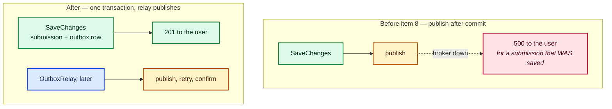
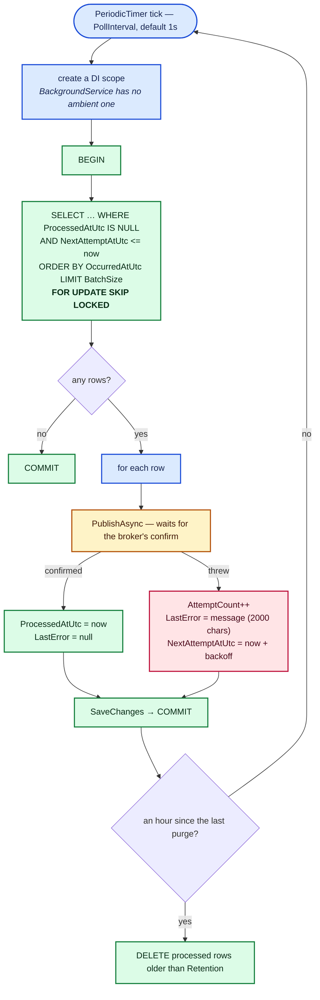
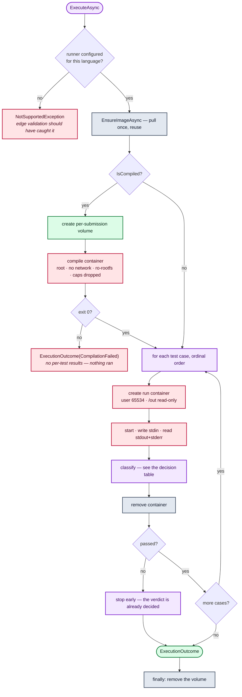
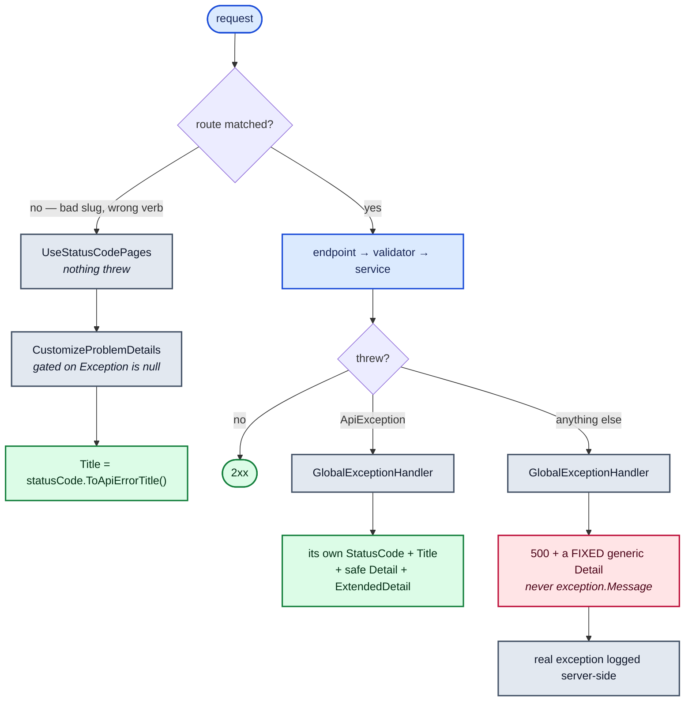
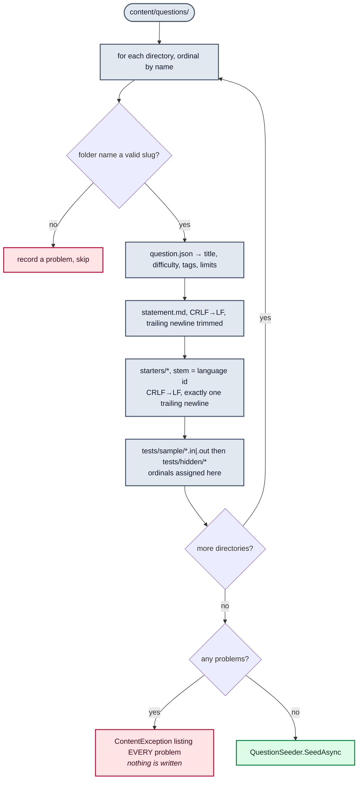
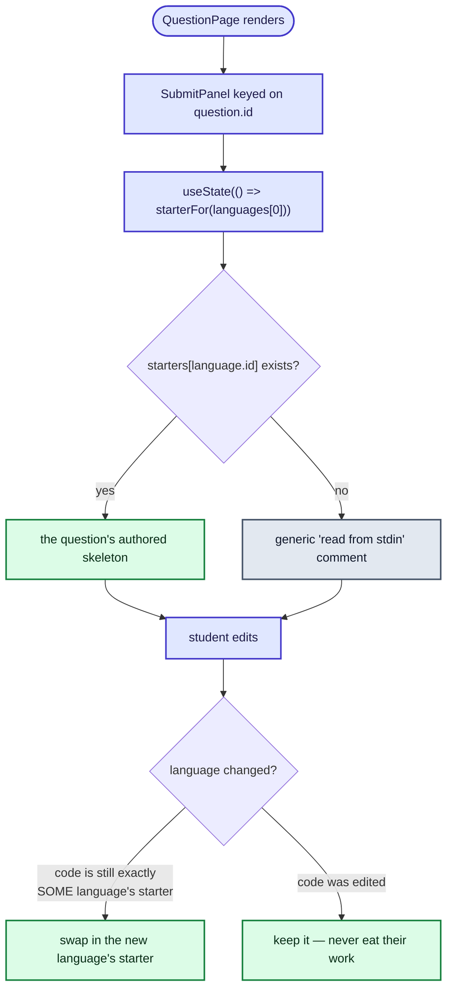

# Low-level design

The algorithms. Read this before changing the outbox or the sandbox — both have correctness
properties that are easy to break by accident and hard to notice afterwards.

## 1 · The transactional outbox

### The problem it solves

Creating a submission has to do two things: save a row, and tell the Judge about it. They live in
different systems, so there is no shared transaction. Whichever order you pick, a crash in between
leaves them disagreeing.



### Write side

`OutboxWriter.Enqueue` stages a row on the **caller's** `DbContext`. It does not save. The caller's
own `SaveChanges` commits the submission and the row together.

```csharp
outboxWriter.Enqueue(db, JudgeRequestFactory.Create(submission, question));
await db.SaveChangesAsync(cancellationToken);   // both, or neither
```

The row carries `Type`, `RoutingKey`, `MessageId` and the serialized `Payload` — everything needed to
publish it — so the relay needs no knowledge of message types at all.

### Relay side



Four properties, each load-bearing:

| Property | Mechanism | Break it and… |
|---|---|---|
| Two relays do not double-publish | `FOR UPDATE SKIP LOCKED` | A second instance blocks, or publishes the same row twice |
| A failed publish stays pending | The transaction spans the publish | A row is marked processed for a message that never went out |
| A dead broker is not hammered | Exponential backoff, capped at `MaxRetryDelay` | One retry per second for the whole outage |
| One bad pass does not kill the relay | `catch` around the pass body | The service silently stops relaying anything |

Holding the transaction open across the publish is unusual, and deliberate: it is what makes a failed
publish roll back to "still pending". It is fine at this scale, and it is why `BatchSize` is small
(20). At a scale where it is not fine, the fix is claim-then-publish-then-mark in separate
transactions, which trades this for more duplicates.

Backoff:

```
delay = min(BaseRetryDelay × 2^(AttemptCount-1), MaxRetryDelay)
      = min(2s × 2^n, 60s)      →  2s, 4s, 8s, 16s, 32s, 60s, 60s, …
```

The exponent is clamped at 20 before the shift, so a long-failing row cannot overflow the `Ticks`
multiplication.

### Delivery guarantee

**At-least-once, never at-most-once.** If the broker confirms and the relay crashes before its
commit, the row is still pending and goes out again. That is the deliberate trade: a duplicate is
absorbed downstream, a lost submission is not recoverable.

## 2 · The sandbox

### Container lifecycle

One throwaway container **per test case**, never reused. A program that corrupts its own filesystem,
leaves a daemon running or fills `/work` cannot affect the next test case, and every run starts from
identical state, so a verdict is reproducible.



### Every control on a run container

| Setting | Value | Stops |
|---|---|---|
| `NetworkMode` | `none` | Mining pools, exfiltration, attacking other hosts |
| `ReadonlyRootfs` | `true` | Persisting anything; tampering with the interpreter |
| `Tmpfs` `/work` | `WorkspaceSizeMb`, default 32 MB, in memory | Filling the host disk; anything surviving the run |
| `User` | `65534:65534` (`nobody`) | Anything that needs to be root |
| `CapDrop` | `ALL` | Every capability-gated syscall |
| `SecurityOpt` | `no-new-privileges`, seccomp | setuid escalation; syscalls a container has no business making |
| `Memory` / `MemorySwap` | Equal, from the question | Swap making the limit soft rather than hard |
| `NanoCPUs` | `CpuCores × 1e9` | One submission starving the others |
| `PidsLimit` | 64 | Fork bombs |
| Wall clock | limit × `TimeLimitMultiplier` + `StartupGraceMs` | A program that never exits |
| Output | capped at `MaxOutputBytes` | A program that prints a gigabyte |
| Lifetime | removed in a `finally` | Leaked containers |

`MemorySwap = Memory` is the subtle one: without it the memory limit is soft, because the kernel
simply swaps.

### Getting the source in

Not `docker cp`, not a bind mount. The source travels as a **base64 environment variable** that the
container decodes into its own tmpfs.

| Alternative | Why not |
|---|---|
| Archive API (`docker cp`) | Docker refuses to copy into a container with a read-only root, and the read-only root is worth more |
| Bind mount | Exposes a host path to submitted code, and would not even resolve correctly when the Judge is itself a container talking to the host daemon |
| Inline in the command | A quote, newline or stray byte in the submission could break out of the shell command |

Base64 makes the payload opaque to the shell. The cap is ~100 KB encoded, because Linux rejects an
environment variable beyond roughly 128 KB.

### Why the compile container runs as root

A Docker volume is created root-owned, so nothing else could write artifacts into it. The trade-off
is narrow and deliberate: that container has no network, no capabilities and a read-only root
filesystem, and it runs a **compiler**, not the submission. The submission only ever *runs* as
`nobody`, with the artifact volume mounted read-only.

### Timing

Measured from the container's **own** start and finish times via `InspectContainerAsync`, not the
wall clock around the whole call. Creating and starting a container costs hundreds of milliseconds,
and charging the submitter for the daemon's overhead would fail correct solutions on a busy host.

The wall clock still governs when the container is killed: *limit × multiplier + startup grace*. The
grace exists because container start, interpreter boot and teardown are not the submitter's fault.

`TimeLimitMultiplier` is per language — a question's limit is written with a native-speed solution in
mind, so an interpreter needs more of it for the same algorithm. Python is 2.0, C# 1.5.

## 3 · Deciding a verdict

### Per test case

| Check, in order | Result |
|---|---|
| Read exceeded limit + grace | `TimeLimitExceeded` — reported as the limit, not the elapsed time |
| `State.OOMKilled` | `MemoryLimitExceeded` |
| Container-measured elapsed > limit | `TimeLimitExceeded` |
| Exit code ≠ 0 | `RuntimeError`, with stderr returned |
| `OutputComparer.Matches` false | `WrongAnswer`, with the actual output returned |
| Otherwise | `Passed` |

### Output comparison

`OutputComparer` is tolerant of formatting and strict about answers:

- CRLF and LF are equivalent
- Trailing whitespace **on each line** is ignored
- Trailing blank lines are ignored
- Everything else must match exactly

A student whose answer is right should not lose to a newline their language's `print` added.

### Per submission

`VerdictAggregator.Aggregate`: **the first failing test case in ordinal order decides.** So "Wrong
answer on test 3" is reproducible, and a later, worse-looking failure cannot mask an earlier one.

A compilation failure short-circuits the whole thing — `CompilationError` with **no** per-test
results, because nothing ran.

## 4 · Error handling

Two paths produce a non-2xx response, and only one of them throws.



The right-hand branch is the easy one to miss. `UseExceptionHandler()` only ever sees a `throw`; a
failed route constraint or a 405 never throws, so without `UseStatusCodePages()` those return the
bare status code with an **empty body**, breaking the "every non-2xx is `ProblemDetails`" contract.
And even with it, the framework titles them with the plain reason phrase (`"Not Found"`) rather than
`api.error.notfound` — hence the `CustomizeProblemDetails` callback, gated on `context.Exception is
null` so it never overwrites what the exception handler already set correctly.

Title strings have exactly **one** source, `ToApiErrorTitle(statusCode)`, called by both paths.

| Exception | Status | Title |
|---|---|---|
| `BadRequestException` | 400 | `api.error.badrequest` |
| `NotFoundException` | 404 | `api.error.notfound` |
| `ConflictException` | 409 | `api.error.conflict` |
| anything else | 500 | `api.error.unknown` |

The 500 branch uses a **fixed** generic detail string, never `exception.Message` — a raw message can
carry a connection string, SQL, or a stack fragment.

## 5 · Validation, in two layers

| Layer | Job | Mechanism | Failure |
|---|---|---|---|
| **Edge** | Shape: required fields, formats, allowed values | FluentValidation in the endpoint | 400, every field error at once |
| **Service** | Rules needing database state: existence, ownership, cross-entity invariants | Guard clauses that throw | 404 / 409 |
| **Database** | Invariants that must hold however the row got there | Check constraints, unique indexes, FKs | 23xxx, surfaced as 500 |

Three layers rather than one because the seeder and the result consumer both **bypass** the Api's
validators entirely. A rule that lives only in a validator is not a rule.

## 6 · Redelivery guard

```csharp
if (!processedSubmissions.TryMarkProcessed(request.SubmissionId))
{
    await channel.BasicAckAsync(delivery.DeliveryTag, ...);   // already judged here
    return;
}
```

`ProcessedSubmissions` is a **bounded in-memory** set, `Judge:ProcessedCacheSize` entries (default
1000). Its limits are real and deliberate:

- It does not survive a Judge restart.
- It does not span Judge instances.
- It evicts once full.

It is an optimisation — it saves re-running an expensive sandbox for the common redelivery case. The
guarantee that always holds is the database check in `JudgedResultRecorder`: a `Completed` submission
ignores a duplicate result. Do not remove that in favour of this one.

## 7 · Content loading



Normalisation differs by file type, on purpose:

| File | Normalisation | Why |
|---|---|---|
| `statement.md`, `*.in`, `*.out` | CRLF→LF, trailing newlines trimmed | A Windows checkout must feed the sandbox exactly what a Linux one does, and an editor's trailing newline is not part of the expected output |
| `starters/*` | CRLF→LF, **exactly one** trailing newline | It is opened in an editor rather than compared byte for byte; a file ending mid-line leaves the caret somewhere odd |

### Upsert

| Situation | Action |
|---|---|
| Slug not in the database | Insert, with new ids |
| Slug present | Update in place — the id survives, because submissions point at it |
| Test case ordinal present | Update in place — the id survives, because results point at it |
| Test case ordinal gone from content | Delete that row |
| Question gone from content | **Left alone.** Deleting is a deliberate SQL act |
| Nothing changed | Nothing written — EF's change tracker decides, not a hand-rolled comparison |

New test cases are added through `db.TestCases.Add` with **no id assigned**. A new entity discovered
on a tracked parent's navigation with its key already set is marked `Modified` rather than `Added`
(the same `IsKeySet` rule `DbContext.Update` uses), which would issue an `UPDATE` against a row that
does not exist yet.

`StartersMatch` compares order-insensitively: a `jsonb` map that round-trips with its keys in a
different order is the same starter set, and rewriting it would report every question as updated on
every run.

## 8 · Starter code resolution, in the SPA



"Untouched" means **any** language's starter for this question, not just the current one's —
otherwise switching Python → C# → Python would leave the C# skeleton in place. The `key` on
`SubmitPanel` matters too: navigating to another problem must reset the editor and drop the previous
verdict rather than keeping this component's state.
