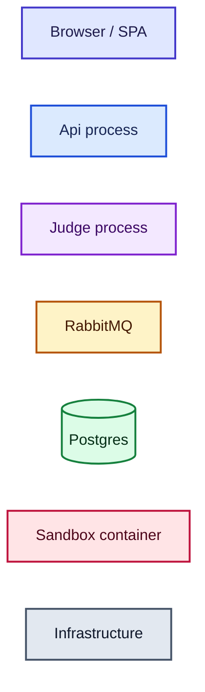

# Design documentation

How the DSA Practice Platform is put together, from the outside in. Nine documents, each one
answering a different question about the same system.

| # | Document | Answers |
|---|---|---|
| — | this file | How to read the set; what the diagram colours mean |
| 01 | [High-level design](01-high-level-design.md) | What the system is, who it serves, what it must guarantee, and the shape that follows from that |
| 02 | [Architecture and deployment](02-architecture.md) | Which processes exist, what runs where, and how a request physically reaches a container |
| 03 | [Use cases](03-use-cases.md) | Who the actors are and what each one can do, with the rules per use case |
| 04 | [Sequence diagrams](04-sequence-diagrams.md) | What happens, in order, for every flow that matters — including the ones that fail |
| 05 | [Class diagrams](05-class-diagrams.md) | The types in each module and how they collaborate |
| 06 | [Data model](06-data-model.md) | Tables, relationships, constraints, indexes, and why each one exists |
| 07 | [Module interaction](07-module-interaction.md) | The assembly graph, the dependency rules, and what is deliberately forbidden |
| 08 | [Low-level design](08-low-level-design.md) | The algorithms: outbox relay, sandbox pipeline, verdict rules, error mapping |

## How to read this

Start with **01** for the shape of the system, then **04** — the sequence diagrams are the fastest
way to understand a codebase whose interesting behaviour is asynchronous. **08** is the one to read
before changing the outbox or the sandbox; both have correctness properties that are easy to break
by accident and hard to notice.

Every document describes **what is built today**, not what is planned. Where something is deliberately
deferred it says so and points at the roadmap item in the root [README](../../README.md), which is
where the sequenced plan and the decisions D1–D11 live. The project skill at
`.claude/skills/dsa-practice-platform/SKILL.md` carries the architecture rules that constrain changes.

## Diagram conventions

Diagrams are [Mermaid](https://mermaid.js.org/), which GitHub renders natively — no image files to
regenerate when the code moves. Colours are consistent across every diagram in the set:

| Colour | Means |
|---|---|
| 🟦 **Indigo** | The browser and anything running in it |
| 🟦 **Blue** | The Api process — HTTP, persistence, orchestration |
| 🟪 **Purple** | The Judge process — consuming, executing, aggregating |
| 🟨 **Amber** | RabbitMQ: exchanges, queues, messages in flight |
| 🟩 **Green** | Durable state — Postgres tables, volumes |
| 🟥 **Rose** | The sandbox, where untrusted code runs. Rose means *do not trust what is in here* |
| ⬜ **Slate** | Infrastructure that isn't ours to write — the Docker daemon, Cloudflare, the VM |

The fills are light with explicit dark text, so they stay legible in GitHub's dark theme as well as
its light one.

## Keeping these honest

A design document that has drifted from the code is worse than none, because it is believed. Two
habits keep the gap small:

- **Name real types and files.** Every class in document 05 exists at the path it claims. A rename
  that breaks a link is a signal, and `grep` finds them.
- **Update the document in the PR that changes the behaviour**, not in a later sweep. The roadmap
  in the root README already works this way, and it is why it is still accurate at item 19a.
