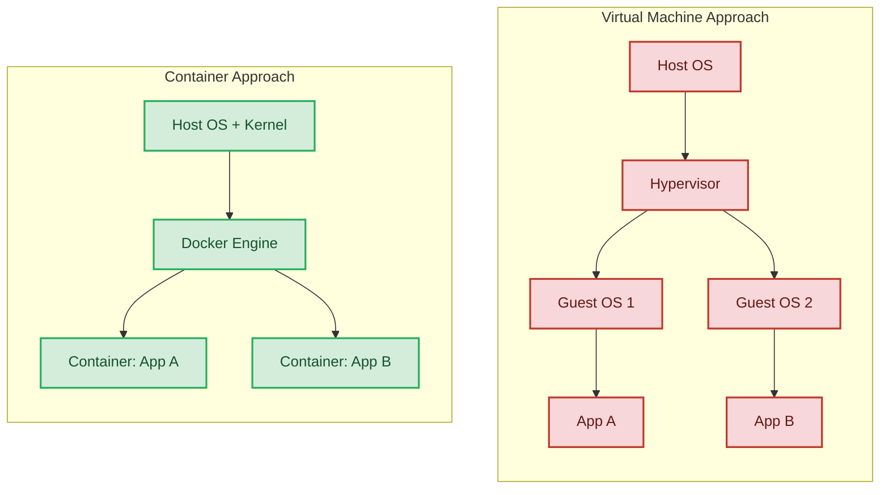
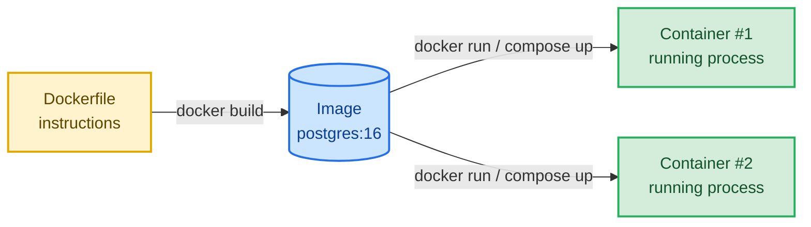
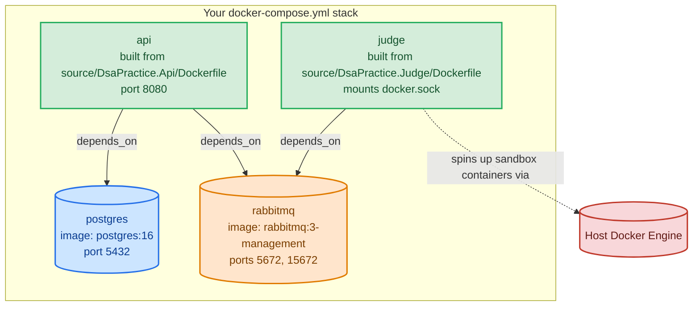
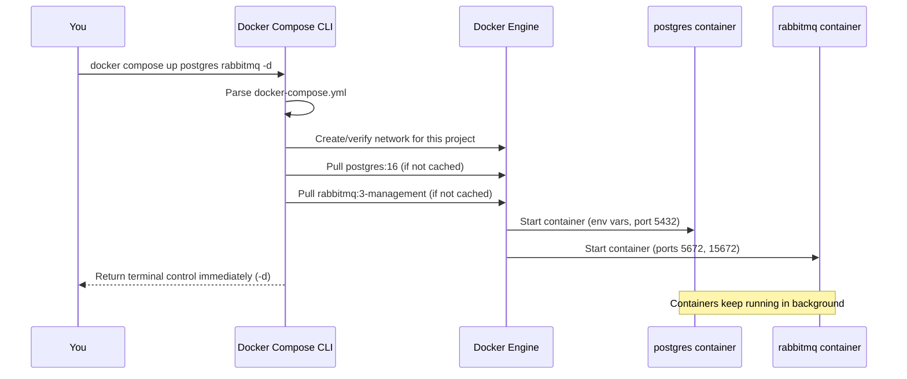
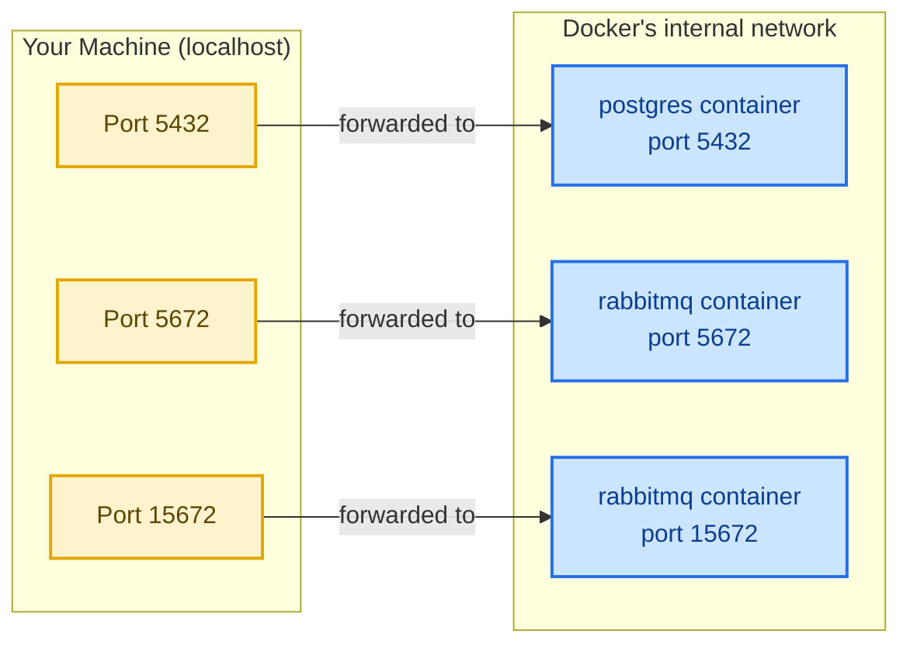
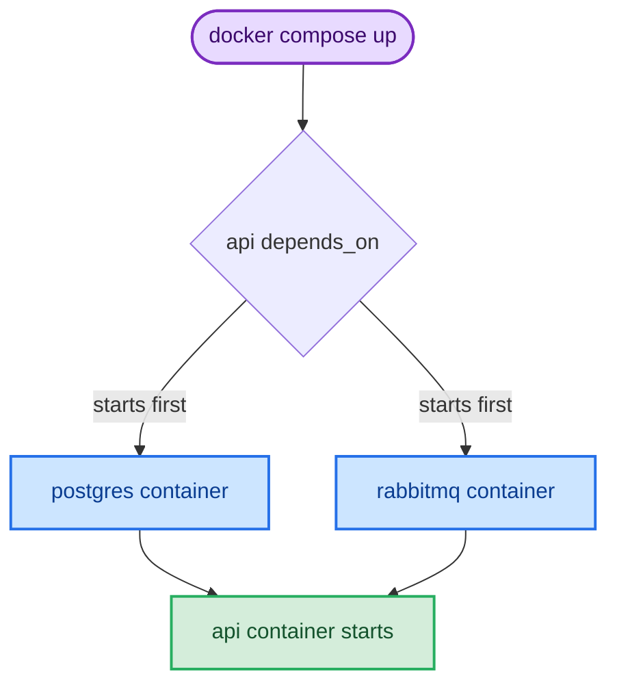
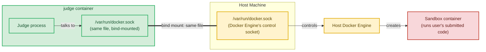
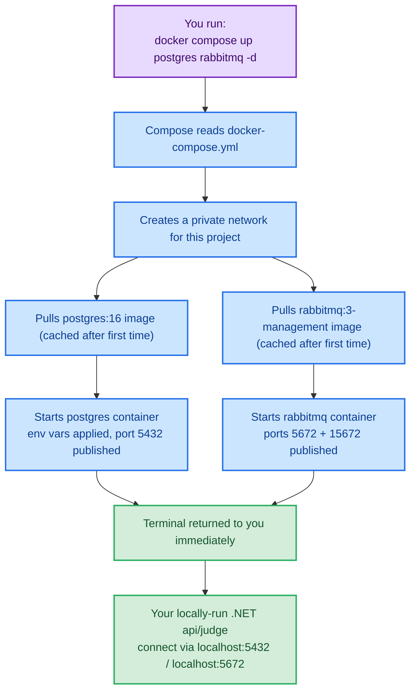

# Docker Basics — A Working Chapter (using your `docker-compose.yml`)

This chapter teaches Docker from the ground up, using your actual `DsaPractice` stack (Postgres + RabbitMQ + API + Judge) as the running example. By the end, you'll be able to read any `docker-compose.yml` and know exactly what a command like:

```bash
docker compose up postgres rabbitmq -d
```

...does, line by line.

---

## 1. Containers vs. Virtual Machines

The first thing to internalize: a container is **not** a lightweight VM. It's an isolated *process* running on the **same** kernel as your host OS.



**Why this matters practically:** each guest OS in the VM model needs its own kernel, memory, boot time — heavy. Containers share the host kernel and only package the app + its dependencies, so they start in milliseconds and use far less RAM. This is why you can casually run 4 services (`postgres`, `rabbitmq`, `api`, `judge`) on your laptop without it grinding to a halt.

---

## 2. Images vs. Containers — the core mental model

This is the single most important distinction in Docker.

- **Image** = a read-only *template* (a recipe + its baked ingredients). Built once, stored, reused.
- **Container** = a *running instance* of an image, with its own writable layer, process space, and network identity.



Relate it to your compose file:

| Concept | Example from your file |
|---|---|
| **Pulled image** (someone else built it) | `postgres:16`, `rabbitmq:3-management` |
| **Built image** (you build it locally) | `api` and `judge`, built from `source/DsaPractice.Api/Dockerfile` and `source/DsaPractice.Judge/Dockerfile` |
| **Container** | What you get when Compose starts each of the above |

So `postgres:16` is one image on Docker Hub. Every time you run `docker compose up postgres`, Docker checks if that image exists locally — if not, it *pulls* (downloads) it — then creates a **container** from it.

---

## 3. What `docker-compose.yml` actually is

A single container is easy to start with `docker run`. But real systems are *multiple* containers that need to talk to each other, share networks, and start in a sane order. **Compose** is a tool that reads a YAML file describing your whole stack and orchestrates all of it with one command.

Your file declares 4 **services** (Compose's word for "a thing that becomes one or more containers"):



Reading the YAML for each service:

- **`postgres`**: uses a public image (`postgres:16`), sets 3 environment variables to configure the default DB/user/password, and maps host port `5432` → container port `5432`.
- **`rabbitmq`**: uses `rabbitmq:3-management` (RabbitMQ + a web management UI baked in), exposes port `5672` (the AMQP broker protocol your app connects to) and `15672` (the browser-based management dashboard).
- **`api`**: instead of `image:`, it has `build:` — Docker builds a *new* image from your own `Dockerfile`, then runs it. `depends_on` tells Compose to start `postgres` and `rabbitmq` first.
- **`judge`**: also built locally. It only depends on `rabbitmq` (not postgres — interesting design signal, it likely consumes jobs off a queue rather than touching the DB directly). It mounts the host's Docker socket, which lets this container *launch other containers* on your machine (a common pattern for sandboxed code-execution judges).

---

## 4. Decoding your exact command

```bash
docker compose up postgres rabbitmq -d
```



Breaking down each token:

| Part | Meaning |
|---|---|
| `docker compose` | The Compose CLI plugin (modern syntax; older tutorials show `docker-compose` with a hyphen — same idea, different CLI generation) |
| `up` | "Create and start" — builds/pulls images if needed, creates a network, starts containers |
| `postgres rabbitmq` | **Named service filter** — only start *these two* services, ignore `api` and `judge` entirely |
| `-d` | "Detached" — run in the background and hand your terminal prompt back, instead of streaming logs and blocking |

**Why would you run just these two?** This is a very common local-dev pattern: you want your *infrastructure dependencies* (database, message broker) running in Docker, while you run the `api` and `judge` .NET projects directly from your IDE (with debugger attached, hot reload, etc.) rather than as containers. Compose is happy to start a subset — it will still create the shared network so your locally-running app can reach `localhost:5432` and `localhost:5672`.

If you *didn't* pass service names, `docker compose up -d` would start **all 4** services, including building `api` and `judge` from their Dockerfiles.

---

## 5. Ports — what "5432:5432" really means



The format is always `"HOST_PORT:CONTAINER_PORT"`. The container is a sealed-off network namespace by default — nothing outside can reach it unless you explicitly publish a port. `"5432:5432"` says: *"traffic hitting my laptop's port 5432 should be forwarded into the container's port 5432, where Postgres is actually listening."*

This is also why your `api` and `judge` containers *don't* need explicit ports to reach postgres/rabbitmq — containers in the same Compose project share an internal Docker network and can reach each other by **service name** (e.g., the API's connection string would point at host `postgres`, not `localhost`). Port publishing (`ports:`) is only needed for *you*, outside Docker, to reach in.

---

## 6. `depends_on` — ordering, not readiness



⚠️ **Common gotcha, worth knowing for real work:** in the basic form you're using (just a service name, no `condition:`), `depends_on` only guarantees **start order** — Docker starts the `postgres` *container process*, not "wait until Postgres has finished initializing and is accepting connections." Postgres can take a second or two to actually be ready to accept queries after its container starts. If `api` connects too fast, it can fail on first launch.

The production-grade fix is a **healthcheck**-based dependency:

```yaml
postgres:
  image: postgres:16
  healthcheck:
    test: ["CMD-SHELL", "pg_isready -U dsapractice"]
    interval: 5s
    timeout: 5s
    retries: 5

api:
  depends_on:
    postgres:
      condition: service_healthy
```

This tells Compose to actually wait for Postgres to report healthy before starting `api`. Worth mentioning if this comes up as a "what would you improve" interview-style question.

---

## 7. Volumes — the one line doing a lot of work

```yaml
judge:
  volumes:
    - /var/run/docker.sock:/var/run/docker.sock
```



A **bind mount** (`host_path:container_path`) makes a file or folder on your host visible *inside* the container, as the same live file — not a copy.

Here, the Docker **socket** (the Unix file the Docker CLI/Engine uses to receive commands) is mounted into the `judge` container. This means code running *inside* `judge` can issue Docker commands that actually run on your **host** engine — that's how it "spins up sandbox containers," as the comment says: it's using the host's own Docker to launch short-lived, isolated containers per code submission (so untrusted user code executes in its own throwaway sandbox, not inside `judge` itself).

⚠️ Worth knowing for architecture discussions: this pattern ("Docker-out-of-Docker" via socket mount) is powerful but has real security weight — any process with access to the Docker socket effectively has root-equivalent control over the host, since it can launch privileged containers. It's a common and pragmatic choice for local judges/CI runners, but it's the kind of tradeoff worth naming explicitly (vs. alternatives like Docker-in-Docker, gVisor/Firecracker sandboxes, or a dedicated remote executor service) if this ever comes up as a design discussion.

---

## 8. Essential command cheat-sheet

| Command | What it does |
|---|---|
| `docker compose up -d` | Start **all** services in the file, detached |
| `docker compose up postgres rabbitmq -d` | Start only the named services |
| `docker compose down` | Stop and **remove** containers + the network (data in named volumes survives; bind mounts always survive) |
| `docker compose ps` | List containers in this project and their status |
| `docker compose logs -f rabbitmq` | Stream (follow) logs for one service |
| `docker compose build api` | Rebuild the `api` image from its Dockerfile without starting it |
| `docker compose restart judge` | Restart just one service's container |
| `docker compose exec postgres psql -U dsapractice` | Run a command *inside* the running `postgres` container (open a psql shell) |
| `docker images` | List all images cached locally |
| `docker ps` | List all *running* containers (across all projects, not just this one) |
| `docker ps -a` | List all containers, including stopped ones |

---

## 9. Putting it all together



**In one sentence:** `docker compose up postgres rabbitmq -d` reads your compose file, pulls/starts only the `postgres` and `rabbitmq` containers on a shared private network with their ports published to your machine, and immediately gives you your terminal back — so you can run your actual .NET services locally against real Postgres and RabbitMQ instances without installing either one natively.

---

## 10. Quick self-check (good for interview drilling)

1. What's the difference between an image and a container? *(template vs. running instance)*
2. Why does `api` use `build:` while `postgres` uses `image:`? *(one is your own code needing compilation into an image; the other is a pre-built public image)*
3. What does `depends_on` **not** guarantee, and how do you fix that? *(readiness, not just start order — fix with `healthcheck` + `condition: service_healthy`)*
4. How do `api`/`judge` reach `postgres`/`rabbitmq` without a published port? *(shared internal Docker network, addressed by service name)*
5. What security tradeoff does mounting `/var/run/docker.sock` introduce? *(container effectively gets host-level control over Docker, i.e., near-root on the host)*