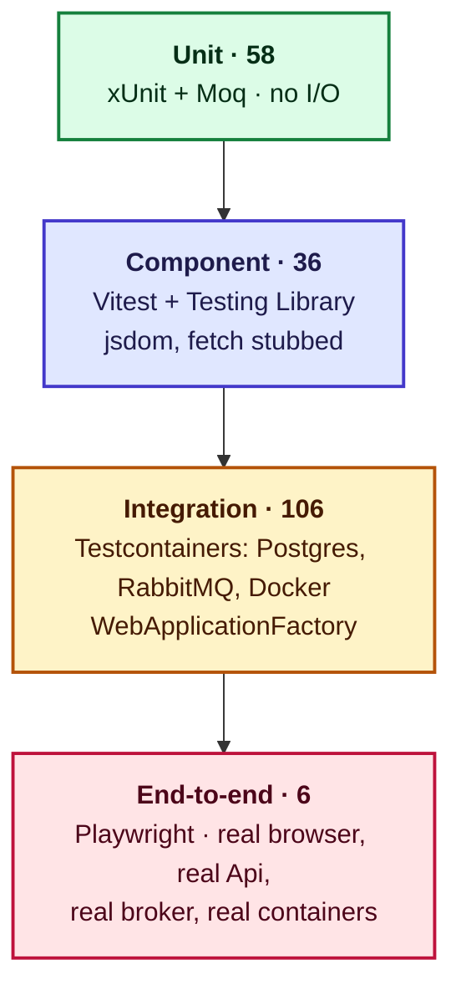
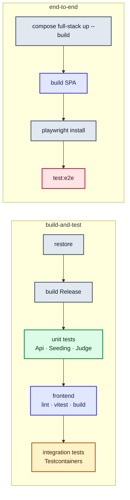

# Testing

What is tested, at which layer, and why there rather than somewhere else.

**206 automated tests today**: 164 .NET (xUnit v3 on Microsoft.Testing.Platform), 36 frontend
(Vitest + Testing Library), 6 end-to-end (Playwright, against the whole stack with nothing stubbed).

For hand-executable cases — smoke runs, exploratory passes, and the specs the Playwright suite grows
from — see [test cases](test-cases.md).

## The shape



It is not a clean pyramid, and that is the right shape for this system. Most of what can go wrong
here is **not** a wrong calculation — it is a message that arrives twice, a transaction that commits
half of what it should, or a container that is less isolated than it looks. None of those can be
proven with a mock, so the integration layer is deliberately the widest.

| Layer | Count | Runs against | Speed |
|---|---|---|---|
| Unit (.NET) | 58 | Nothing external | ~3 s per project |
| Component (frontend) | 36 | jsdom, `fetch` stubbed | ~5 s |
| Integration (.NET) | 106 | Real Postgres, RabbitMQ, Docker | 18 s – 80 s per project |
| End-to-end | 6 | The entire stack | ~20 s |

## Projects

One test project per production assembly, split by type — never a combined `Foo.Tests` mixing both.

| Project | Tests | Covers |
|---|---|---|
| `DsaPractice.Api.UnitTests` | 11 | Error-title mapping, `GlobalExceptionHandler`, `JudgeRequestFactory` |
| `DsaPractice.Api.IntegrationTests` | 53 | Endpoints, auth and ownership, outbox, judged-result recording, database constraints |
| `DsaPractice.ContentSeeding.UnitTests` | 23 | `ContentLoader` against real files in a temp folder |
| `DsaPractice.ContentSeeding.IntegrationTests` | 13 | `QuestionSeeder` against real Postgres with the real migrations |
| `DsaPractice.Judge.UnitTests` | 24 | `OutputComparer`, `VerdictAggregator`, `ProcessedSubmissions` |
| `DsaPractice.Judge.IntegrationTests` | 40 | The Docker sandbox, both language runners, the consumer, **sandbox escapes** |
| `frontend` (Vitest) | 36 | Pages, components, the generated API client |
| `frontend/e2e` (Playwright) | 6 | Browse → write → submit → verdict, for real |

## Unit tests — 58

Fast, isolated, no I/O. They exist for the things that are genuinely a function of their inputs.

| What | Why it earns a unit test |
|---|---|
| `OutputComparer` | The rule is subtle — tolerant of trailing whitespace, CRLF and trailing blank lines, strict about everything else. Thirteen cases, none of which need a container |
| `VerdictAggregator` | "The first failing test case in run order decides" is the rule a student's verdict depends on. Pure function over an `ExecutionOutcome` |
| `ProcessedSubmissions` | A bounded cache: first sight, second sight, and eviction past capacity |
| `JudgeRequestFactory` | That the message carries **every** test case, hidden ones included, ordered by ordinal, with ids that match results back |
| `ApiErrorTitlesHelper` | Status code → `api.error.*`, the single source both error paths call |
| `GlobalExceptionHandler` | That an `ApiException` maps to its own status and title, and that anything else maps to 500 with a **generic** message rather than `exception.Message` |

`ContentLoader`'s 23 tests are counted as unit tests even though they write real files into a temp
folder. Reading a directory tree is its entire job; mocking a filesystem abstraction that exists only
for the tests would prove less and cost more.

## Integration tests — 106

Real Postgres, real RabbitMQ, real Docker, through Testcontainers. Never a mocked database.

### Api

`ApiWebApplicationFactory` boots the real app with `WebApplicationFactory<Program>` and points it at
containers it starts itself. Two details worth knowing before you write one:

- **A real broker, not a mocked publisher.** Creating a submission publishes, so every test in the
  collection needs somewhere for that message to go — and tests can read the queue back to assert
  what was published.
- **`Outbox:RelayEnabled` is false.** Tests drive `OutboxProcessor` directly and assert what one pass
  does, instead of racing a one-second timer. The loop around it is covered by starting the app at
  all.

Grouped by what they protect:

| Area | Proves |
|---|---|
| Endpoints | Hidden test cases never leave the read API; sample ordering; starters keyed by language; empty map rather than null; 404 for both an unknown slug and a malformed one |
| Auth | Provisioning on first sight, the same person reusing one row, different people kept apart, a caller **cannot choose** who a submission belongs to, someone else's submission is 404 not 403, an admin can read anyone's, an unreadable token does not inherit an identity |
| Outbox | The row is written and **nothing** is published inline; an unknown question writes no row; a pass publishes and marks processed; a second pass does not republish; an unroutable message leaves the row pending with backoff and the error recorded; a row not yet due is left alone; the purge deletes only long-processed rows |
| Judged results | Accepted and failing results applied; **the same result twice leaves the first alone**; an unknown submission is discarded; compilation error stores compile output and no per-test rows; huge output truncated; hidden output never returned |
| Constraints | Duplicate slug, malformed slug, non-positive limits, duplicate ordinal, the same ordinal on different questions, unknown-question FK, and the verdict-iff-completed check — asserted against the database, because the seeder and the result consumer bypass the Api's validators |

### Content seeding

`PostgresFixture` applies the **real migrations**, not `EnsureCreated`. The seeder writes without
going through the Api's validators, so its output has to satisfy the schema's own check constraints;
testing it against a hand-built table would prove nothing.

Covers the upsert contract end to end: insert, re-run changes nothing, edits update in place keeping
ids, test cases appended / removed / edited, a question absent from content left alone, a schema
violation rolling back the whole run, and the `jsonb` starters round-tripping — including that
re-ordering keys is **not** a change.

### Judge

The widest suite, because it is where untrusted code runs.

| File | Proves |
|---|---|
| `DockerSandboxExecutorTests` | Pass, wrong answer, non-zero exit, infinite loop (and the container is gone afterwards), memory overshoot, **no network**, no writing outside the workspace, runs as non-root, a fork bomb is contained and the host survives, output flood capped, stops at the first failure, unknown language throws |
| `PythonRunnerTests` | The real reference solution against the real test cases; wrong answer on the case that disagrees; syntax error and exception both surfacing Python's own message; infinite loop; **a brute-force solution exceeding the limit on the large test case**; no network |
| `CSharpRunnerTests` | Reference solution accepted; code that does not compile is `CompilationError` with nothing run; unhandled exception carries the .NET stack trace; wrong output; infinite loop; a compiled program cannot write to its own artifacts; the artifact volume is removed afterwards |
| `JudgeRequestConsumerTests` | Accepted published and the request acked; a failing case published with per-test results; an executor throwing reports `InternalError` **and** dead-letters; a malformed payload dead-lettered without judging; **delivered twice, executed once** |
| `SandboxEscapeTests` | Cannot see the Docker socket, has no capabilities, cannot regain privileges, cannot see other processes, cannot mount, cannot write to kernel interfaces, cannot read host devices, cannot exceed the pids cap by raising its own rlimits, cannot keep a process alive after the run |

`SandboxEscapeTests` is the one to run after touching anything in `DockerSandboxExecutor`. Every
control in [sandbox hardening](sandbox-hardening.md) has an assertion here; a control that is only
described and not asserted is a control that will quietly stop working.

## Component tests — 36

Vitest, Testing Library, jsdom. `fetch` is stubbed via `stubFetchJson`; the real API is not involved.

Monaco needs a canvas jsdom has not got, so `@monaco-editor/react` is mocked as a controlled
`<textarea aria-label="Source code">`. That is deliberate: these tests are for what `SubmitPanel`
owns — language choice, starters, submitting, polling, showing the verdict — not for Monaco.

| File | Proves |
|---|---|
| `QuestionsPage` | Lists with difficulty, links by slug, filters by difficulty and by topic (offering only topics that exist), says so when nothing matches, reports a failure rather than showing an empty list |
| `QuestionPage` | Title, difficulty and the limits the Judge enforces; statement rendered as markdown; every sample with input and output; a 404 explained in its own terms; other failures reported as failures |
| `SubmitPanel` | Submits the chosen language and edited code with **no `userId`**; polls until judged; disabled while judging; cannot submit an empty editor; keeps code the user wrote across a language change; opens with the question's starter; swaps starters when untouched; falls back to a generic skeleton; submits a partly-filled starter |
| `VerdictPanel` | Says it is judging while pending; spells verdicts out for a person; says a judge error is not the submitter's fault; each test case with its time; **never shows output for a hidden case**; compiler output when the code never ran |
| `client` | Requests the collection; **escapes the slug** so a crafted value cannot alter the path; sends JSON; throws an `ApiError` carrying the `ProblemDetails`; still fails usefully when the error body is not JSON |

## End-to-end — 6

Playwright against the real stack: the built frontend, the real Api, RabbitMQ, and a Judge that
really runs the submitted code in a container. Nothing stubbed, which is the point — a failure here
means a student would have hit it.

| Test | Proves |
|---|---|
| Browse to a question | The list, the link, the statement rendered as real headings |
| The editor opens with the starter | The authored skeleton arrives and swaps on language change |
| A correct solution is accepted | The whole loop, with every test case reported and hidden ones shown as pass/fail only |
| A wrong solution is rejected | The verdict, and the student's own output shown back |
| A crash is a runtime error | Not misreported as a wrong answer |
| Difficulty filtering | The list narrows |

Typing into Monaco goes through the **clipboard**, not keystrokes: it auto-indents and auto-closes
brackets, so typing Python character by character produces mangled code.

## Running them

```bash
# Everything .NET. MTP mode (global.json) needs --solution; a bare path is rejected.
dotnet test --solution source/DsaPractice.slnx

# One project
dotnet test --project tests/DsaPractice.Judge.UnitTests/DsaPractice.Judge.UnitTests.csproj

# Frontend
cd frontend && npm test          # once
cd frontend && npm run test:watch

# End-to-end — needs the full stack up
docker compose --profile full-stack up -d --build
cd frontend && npm run build && npm run test:e2e
```

> **Integration tests need Docker running.** The first run pulls images and is slow; later runs are
> not. If a crashed run leaves containers behind, `testcontainers/ryuk` normally reaps them —
> `docker ps -a --filter label=org.testcontainers=true` shows any that survived.

> **Playwright on this machine** needs system libraries installed with
> `sudo npx playwright install-deps`. Until then, run the suite through the
> `mcr.microsoft.com/playwright` image.

[The debugging guide](debugging.md#debugging-tests) covers stepping through a failing test.

## CI



**Unit before integration, deliberately**: fast feedback without waiting on Docker, and a unit
failure surfaces before paying for the Testcontainers run at all. End-to-end is its own job because
it builds images and is slower than everything else combined; service logs and the Playwright report
are uploaded on failure.

## Conventions

- **xUnit v3** on Microsoft.Testing.Platform, everywhere.
- **`Method_Scenario_ExpectedResult`** naming. The names above are the specification — reading them
  in order tells you what the system promises.
- **Test behaviour through the public surface.** Internals reach tests via `internal` +
  `InternalsVisibleTo`, never reflection.
- **Testcontainers over mocks** for anything that touches a database, a broker or Docker.
- **`WebApplicationFactory`**, never `TestServer` directly.
- **Every test asserts something.** No test that runs code and checks nothing.
- **A fake `TimeProvider`**, never wall-clock time — production code injects it, so tests substitute
  it. That is how backoff and retention are tested without waiting.
- **Test-first for anything non-trivial.** "Done" is a passing test that was failing first.

## What is not covered

Stated rather than implied, because an unlisted gap reads as a covered one.

| Gap | Status |
|---|---|
| **Load and performance** | Nothing. Item 30's launch checklist has a smoke test; real limits arrive with rate limiting (item 22) |
| **gVisor (`runsc`)** | `Judge:Sandbox:Runtime` is a passthrough, **unverified** — gVisor cannot be installed under Docker Desktop on WSL2. Re-run `SandboxEscapeTests` on the production VM (item 25) |
| **Accessibility** | No automated checks. Axe in the Playwright suite is part of item 25a |
| **Visual regression** | None, and not planned for v1 |
| **The outbox relay's loop** | `OutboxProcessor` is tested directly; the `PeriodicTimer` around it is only covered by the app starting. Deliberate — testing a timer tests the timer |
| **Multi-instance behaviour** | `FOR UPDATE SKIP LOCKED` is written for it but never tested with two relays running |
| **`SubmissionStatus.Running`** | Only referenced by constraint tests; nothing assigns it (see [data model](design/06-data-model.md)) |
| **Cross-browser** | Chromium only |
| **Manual and exploratory passes** | [test-cases.md](test-cases.md) |

## Adding a test

| Question | Layer |
|---|---|
| Is it a function of its inputs? | Unit |
| Does it need a database, a broker or Docker to be true? | Integration |
| Is it what a component renders or does? | Component (Vitest) |
| Would a student notice it, across the whole stack? | End-to-end |

Prefer the lowest layer that can actually prove the thing. A rule that only holds because Postgres
enforces it does not belong in a unit test, and a rendering detail does not belong in Playwright.

## See also

- [Test cases](test-cases.md) — hand-executable specs, and where each is automated
- [Design documentation](design/README.md) — what the tests are asserting about
- [Sandbox hardening](sandbox-hardening.md) — every control `SandboxEscapeTests` asserts
- [Debugging guide](debugging.md) — stepping through a failing test
